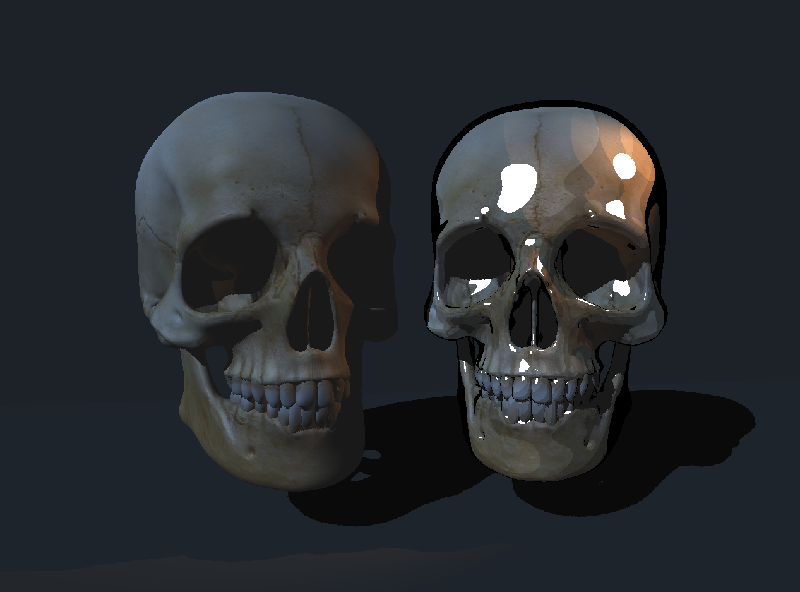

<div align="center">



# 3D Software Rasterizer

**Built from scratch in C++ using SDL3 — no engines, no graphics APIs, no shortcuts.**

<a href="https://hambup.me">
  
</a>
&nbsp;
<a href="https://isocpp.org/">
  
</a>
&nbsp;
<a href="https://wiki.libsdl.org/SDL3/FrontPage">
  
</a>

</div>

---

## What it is

A fully CPU-rendered 3D rasterizer — every pixel computed in plain C++, no GPU involved. The full pipeline (transformations, projection, rasterization, lighting, shadows) is implemented from scratch using only SDL3 for the window.

> **Note:** Triangle clipping is not implemented — geometry that crosses the camera's near plane will break. Everything else in the pipeline is complete.

## Features

| | |
|---|---|
| **Math** | Custom Vec2 · Vec3 · Vec4 · Mat4 from scratch |
| **Pipeline** | Full MVP — Model · View · Projection matrices derived from first principles |
| **Rasterization** | Barycentric coordinates · perspective-correct interpolation |
| **Depth** | Z-buffer with per-pixel depth testing |
| **Parsing** | OBJ + BMP parser — zero external libraries |
| **Camera** | Free WASD + mouse look · yaw · pitch |
| **Textures** | UV mapping · perspective-correct sampling |
| **Culling** | Backface culling · frustum culling (X/Y planes) |
| **Lighting** | Phong shading · directional + spot lights · toon shading |
| **Shadows** | Shadow mapping · adaptive bias · spotlight perspective projection |
| **Threads** | Multithreaded rasterizer across all CPU cores |

## Stack

`C++17` · `SDL3` · `CMake` · `CLion`

## Build

```bash
git clone https://github.com/HambuP/3D-Rasterizer-in-Cpp-using-SDL3.git
cd 3D-Rasterizer-in-Cpp-using-SDL3
mkdir build && cd build
cmake ..
cmake --build .
```

Requires SDL3 installed. Set the working directory to the project root in your run configuration.

## Documentation

The full pipeline is documented step by step at **[hambup.me/rasterizer](https://hambup.me)** — every section covers the math, the code, and what broke along the way.

## License

MIT
