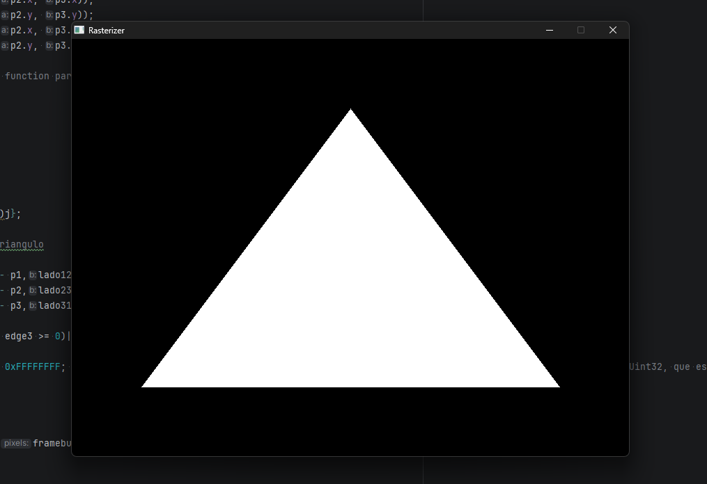
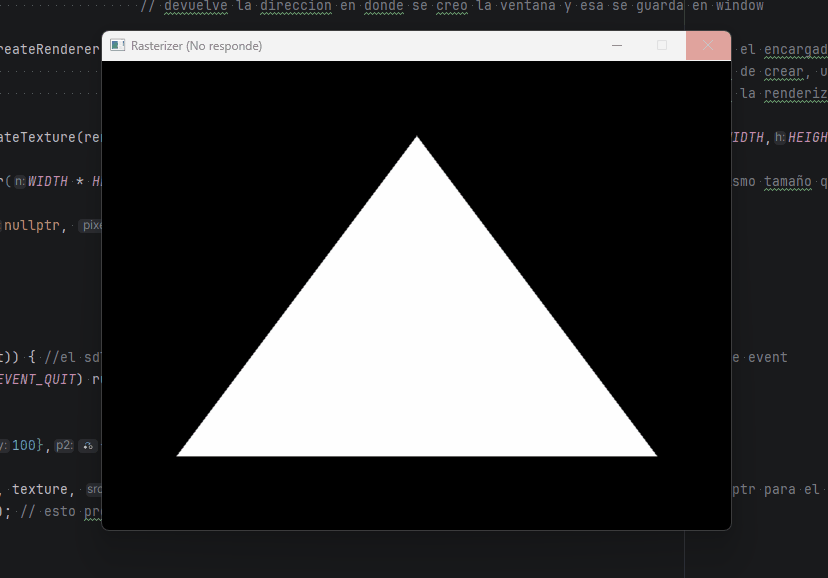

# Framebuffer & Flat Triangle

<p class="subtitle">The first goal: get a single pixel on screen. Then a triangle.</p>

---

## The starting point

Before any math, before matrices or lighting, the first question is purely mechanical: **how do you draw anything at all?** The answer is the framebuffer — and understanding it is the foundation of everything else in this project.

## What is a framebuffer

A framebuffer is a flat array of pixels stored in memory. Each element represents one pixel on screen, encoded as a 32-bit integer in **ARGB format** — 8 bits each for alpha, red, green, and blue. ARGB is the format SDL3 expects: the highest byte is alpha (opacity), followed by the three color channels. Each channel goes from 0 to 255, so a full red pixel is `(255 << 24) | (255 << 16) | (0 << 8) | 0`.

```cpp
std::vector<Uint32> framebuffer(WIDTH * HEIGHT, 0);
```

To write a pixel at `(x, y)`:

- `y * WIDTH + x` converts 2D screen coordinates into the 1D array index
- `<<` packs the RGB channels into a single 32-bit integer
- `std::min(..., 255.0f)` clamps values to avoid overflow — without it, anything above 1.0 wraps around and produces a wrong color

```cpp
// pixel at (x, y) → index y * WIDTH + x
framebuffer[j * WIDTH + i] = (255 << 24) |
    (static_cast<int>(std::min(color.x * 255.0f, 255.0f)) << 16) |
    (static_cast<int>(std::min(color.y * 255.0f, 255.0f)) << 8) |
     static_cast<int>(std::min(color.z * 255.0f, 255.0f));
```

With `color = {1, 1, 1}`, this writes a white pixel.

## SDL3 setup

SDL3 handles the window, input, and the bridge between the CPU framebuffer and what's displayed on screen. Three objects to initialize:

```cpp
SDL_Init(SDL_INIT_VIDEO);
SDL_Window*   window   = SDL_CreateWindow("Rasterizer", WIDTH, HEIGHT, 0);
SDL_Renderer* renderer = SDL_CreateRenderer(window, nullptr);
SDL_Texture*  texture  = SDL_CreateTexture(renderer,
    SDL_PIXELFORMAT_ARGB8888, SDL_TEXTUREACCESS_STREAMING, WIDTH, HEIGHT);
```

- **Window** — the OS window. SDL manages it internally, we just keep a pointer.
- **Renderer** — handles drawing to the window. `nullptr` lets SDL choose the best driver.
- **Texture** — the bridge between the CPU-side framebuffer and what SDL paints on screen.

Every frame:

```cpp
// 1. Clear framebuffer for the new frame
std::fill(framebuffer.begin(), framebuffer.end(), 0);

// 2. ... write pixels into the framebuffer ...

// 3. Upload framebuffer to the SDL texture
SDL_UpdateTexture(texture, nullptr, framebuffer.data(), WIDTH * sizeof(Uint32));

// 4. Draw texture to renderer
SDL_RenderTexture(renderer, texture, nullptr, nullptr);

// 5. Present frame on screen
SDL_RenderPresent(renderer);
```

## Drawing the first triangle

With the framebuffer ready, drawing a flat triangle works by scanning every pixel inside a **bounding box** — the smallest rectangle that contains the triangle — and testing each pixel with the edge function.

The edge function is the 2D cross product:

\[
f(\mathbf{a}, \mathbf{b}) = a_x \cdot b_y \;-\; a_y \cdot b_x
\]

It returns the signed area of the parallelogram formed by **a** and **b** — which is twice the signed area of the triangle. Positive means the point is to the left of the edge, negative means right.

```cpp
inline float edge_function(const Vec2& a, const Vec2& b) {
    return a.x * b.y - a.y * b.x;
}
```

The rasterization loop:

```cpp
// Bounding box — only test pixels that could be inside the triangle
int minx = std::max((int)std::min({pA.x, pB.x, pC.x}), 0);
int miny = std::max((int)std::min({pA.y, pB.y, pC.y}), 0);
int maxx = std::min((int)std::max({pA.x, pB.x, pC.x}), WIDTH  - 1);
int maxy = std::min((int)std::max({pA.y, pB.y, pC.y}), HEIGHT - 1);

for (int i = minx; i <= maxx; i++) {
    for (int j = miny; j <= maxy; j++) {
        Vec2 p = {(float)i, (float)j};

        // Edge test for each side — is P on the correct side of each edge?
        float e1 = edge_function(p - pA_2d, ladoAB);
        float e2 = edge_function(p - pB_2d, ladoBC);
        float e3 = edge_function(p - pC_2d, ladoCA);

        // All same sign → inside the triangle → paint pixel
        if ((e1 >= 0 && e2 >= 0 && e3 >= 0) ||
            (e1 <= 0 && e2 <= 0 && e3 <= 0)) {
            framebuffer[j * WIDTH + i] = color;
        }
    }
}
```

The three edge values (e1, e2, e3) are more than just an inside/outside test. Their ratios — e1/(e1+e2+e3), e2/(e1+e2+e3), e3/(e1+e2+e3) — tell you exactly <span class="accent-gold">how far the point is from each vertex</span>. These normalized ratios are the barycentric coordinates (λ₁, λ₂, λ₃): three weights that describe any point inside the triangle as a <span class="accent-red">weighted blend of its three corners</span>. Interpolating — computing a smooth value between the three vertices for every pixel in between — is what makes <span class="accent-sage">color gradients, depth, and UV texturing</span> possible. The demo below gives an intuition, and the next section covers how and why they work in full.
<div class="viz-wrapper">
  <div class="viz-header">
    <span class="viz-label">● Interactive</span>
    <span class="viz-hint">drag the vertices or point P to explore</span>
  </div>
  <iframe
    src="../../assets/viz/barycentric_coords.html"
    width="100%"
    height="380"
    frameborder="0">
  </iframe>
</div>

And here's the result:

{ .page-img }

<p class="img-caption">The first triangle — white, flat, no shading.</p>

---

## Bug — 30 seconds to draw a triangle

<div class="bug-card">
  <div class="bug-header">
    <span class="bug-tag">BUG</span>
    <span class="bug-title">Window loads, freezes for 30 seconds, then crashes</span>
  </div>
  <div class="bug-body">
    <div class="bug-row">
      <span class="bug-label">What happened</span>
      <span>The window appeared, showed nothing, became unresponsive, and closed on its own. Drawing a single triangle was taking ~30 seconds.</span>
    </div>
    <div class="bug-row">
      <span class="bug-label">Cause</span>
      <span>Two problems at once. First, <code>SDL_UpdateTexture</code> was being called inside the per-pixel loop — uploading the entire texture to the GPU on every single pixel write. Second, the framebuffer was being passed by value into the rasterizer function, so the entire array was copied every frame.</span>
    </div>
    <div class="bug-row">
      <span class="bug-label">Fix</span>
      <span>Move <code>SDL_UpdateTexture</code> to after the full frame is drawn. Pass the framebuffer by reference (<code>&</code>) so no copy happens. The second fix was adding a single character.</span>
    </div>
  </div>
</div>

{ .page-img }

<p class="img-caption">The window freezing before the fix.</p>

<div class="page-nav">
  <a href="../" class="page-nav-btn prev">← Home</a>
  <a href="../02_barycentric/" class="page-nav-btn next">Barycentric Coordinates →</a>
</div>