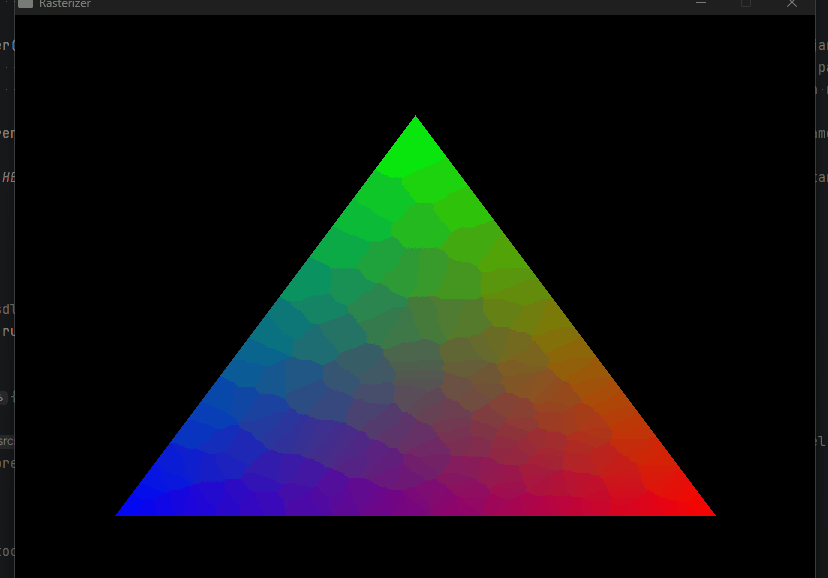

# Barycentric Coordinates & Color Interpolation

<p class="subtitle">From inside/outside test to per-pixel interpolation.</p>

---

## The edge function revisited

In the previous section, the edge function was used to determine whether a point was <span class="accent-gold">inside a triangle</span>. But the three values it produces — e1, e2, e3 — contain **much more information** than just that.

## What are barycentric coordinates

Barycentric coordinates are <span class="accent-red">three weights (λ₁, λ₂, λ₃)</span> that describe the position of any point inside a triangle in terms of its vertices. Their fundamental property:

\[ \lambda_1 + \lambda_2 + \lambda_3 = 1 \]

Each weight is between 0 and 1 — λ₁ = 1 means you're exactly at vertex A, λ₁ = 0 means you're on the opposite side. Geometrically, <span class="accent-sage">each λ is the area of the sub-triangle opposite to the corresponding vertex</span>, divided by the total area:

\[ \lambda_1 = \frac{\text{area}(PBC)}{\text{area}(ABC)} \qquad \lambda_2 = \frac{\text{area}(PCA)}{\text{area}(ABC)} \qquad \lambda_3 = \frac{\text{area}(PAB)}{\text{area}(ABC)} \]

And here's the connection to the edge function: each e1, e2, e3 already computed is **proportional to those areas**. Dividing by the total area gives exactly the barycentric coordinates:

```cpp
float const area_total = e1 + e2 + e3;

// Normalized barycentric coordinates
float const e1_norm = e1 / area_total; // λ for vertex C
float const e2_norm = e2 / area_total; // λ for vertex A
float const e3_norm = e3 / area_total; // λ for vertex B
```

## Interpolating color

With barycentric coordinates, interpolating any value across the triangle is a <span class="accent-gold">weighted sum</span>:

\[ \text{value} = \lambda_1 \cdot \text{value}_A + \lambda_2 \cdot \text{value}_B + \lambda_3 \cdot \text{value}_C \]

For RGB colors, it applies per channel:

```cpp
// Color interpolation using barycentric coordinates
Vec3 color = colorC * e1_norm + colorA * e2_norm + colorB * e3_norm;
```

<div class="viz-wrapper">
  <div class="viz-header">
    <span class="viz-label">● Interactive</span>
    <span class="viz-hint">change vertex colors to see the blend update in real time</span>
  </div>
  <iframe
    src="../../assets/viz/barycentric_color.html"
    width="100%"
    height="380"
    frameborder="0">
  </iframe>
</div>

## Perspective-correct interpolation

Direct barycentric interpolation works perfectly for colors in 2D. But it **breaks for 3D attributes** — UV coordinates, normals, depth — because perspective projection distorts distances in screen space. Points that are far away get compressed toward the center, so linear interpolation in screen space produces the wrong result.

The fix involves dividing by <span class="accent-red">**w**</span> — the original depth of each vertex before the perspective divide — before interpolating. This corrects for the non-linear distortion introduced by perspective. This is covered in full in the [UV Texturing](../06_uv.md/) section.

## Bug — coordinates assigned to the wrong vertex

<div class="bug-card">
  <div class="bug-header">
    <span class="bug-tag">BUG</span>
    <span class="bug-title">Colors appear at the wrong vertices</span>
  </div>
  <div class="bug-body">
    <div class="bug-row">
      <span class="bug-label">What happened</span>
      <span>Colors appeared at the wrong vertices — red where blue should be, blue where green should be.</span>
    </div>
    <div class="bug-row">
      <span class="bug-label">Cause</span>
      <span>e1 faces vertex C (it's the area of sub-triangle PBA), e2 faces A, and e3 faces B. They had been assigned backwards — e1 to A, e2 to B, e3 to C.</span>
    </div>
    <div class="bug-row">
      <span class="bug-label">Fix</span>
      <span>Understand which edge function corresponds to which vertex. <code>e1 = edge(P−A, B−A)</code> measures how much C "weighs" at that point, not A.</span>
    </div>
  </div>
</div>

## Result

And here's the result:

{ .page-img }

<p class="img-caption">Color interpolation working — every pixel is a weighted blend of the three vertex colors.</p>

With barycentric coordinates working, the next step is depth — how to decide which triangle **wins** when two overlap on screen.

<div class="page-nav">
  <a href="../01_framebuffer/" class="page-nav-btn prev">← Framebuffer & Flat Triangle</a>
  <a href="../03_zbuffer/" class="page-nav-btn next">Z-Buffer →</a>
</div>