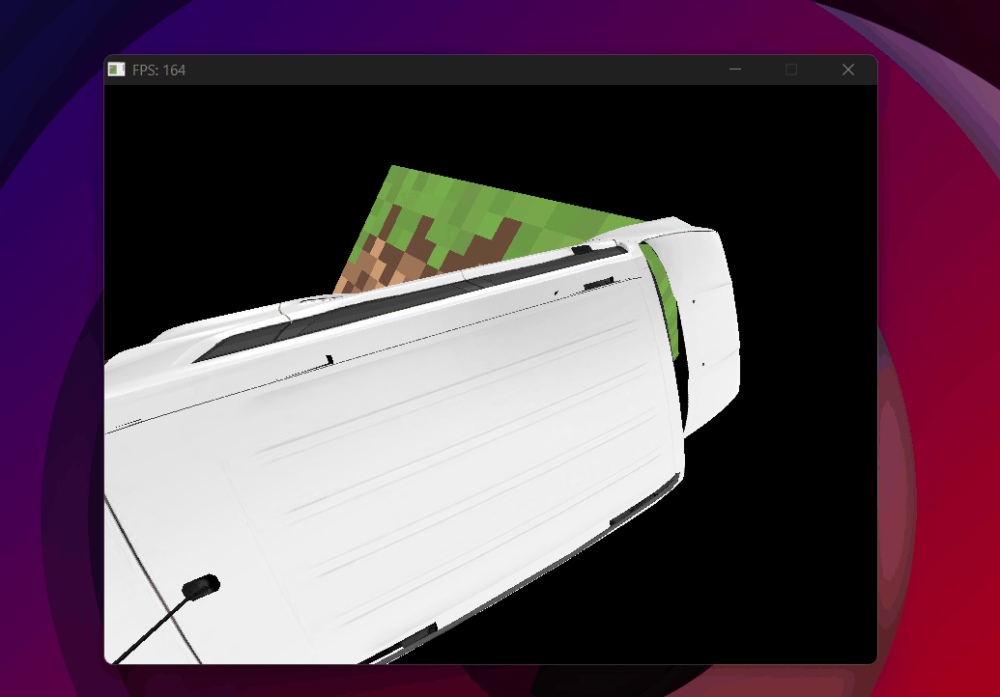

# Z-Buffer & Depth Testing

<p class="subtitle">From triangles always painting over each other to correct depth ordering.</p>

---

## The problem

With the basic rasterizer working, the next problem is obvious: what happens when two triangles overlap? Without any depth system, <span class="accent-red">the last one drawn always ends up on top</span> — regardless of whether it's actually behind the other one in 3D space. That's wrong.

## What is a z-buffer

The z-buffer is a second array the same size as the framebuffer, but instead of storing colors, it stores the **depth of the closest pixel drawn so far**. Before painting a pixel, we compare its depth to what's already in the buffer. If it's closer, we paint and update. If not, we skip it.

```cpp
std::vector<float> zbuffer(WIDTH * HEIGHT, HUGE_VALF);
// HUGE_VALF = positive infinity — initially "nothing has been drawn"
```

The per-pixel test:

```cpp
// Depth test — only paint if this pixel is closer than what's already there
if (depth < zbuffer[j * WIDTH + i]) {
    zbuffer[j * WIDTH + i] = depth; // update stored depth
    framebuffer[j * WIDTH + i] = color; // paint pixel
} else {
    continue; // skip — something closer is already in front
}
```

<div class="viz-wrapper">
  <div class="viz-header">
    <span class="viz-label">● Interactive</span>
    <span class="viz-hint">see how the depth test resolves overlap per pixel</span>
  </div>
  <iframe
    src="../../assets/viz/zbuffer.html"
    width="100%"
    height="380"
    frameborder="0">
  </iframe>
</div>

## Interpolating depth

The depth of each pixel is interpolated across the triangle using barycentric coordinates — just like color. But there's an important catch: <span class="accent-gold">you can't interpolate z directly</span>. After perspective projection, z is no longer linear in screen space — points far away are compressed, so a straight interpolation would give the wrong depth. This will make more sense when UV mapping is covered, since the same distortion affects texture coordinates.

What *is* linear in screen space is **1/w** — the inverse of each vertex's original depth (how far it is from the camera, before any projection). Interpolating 1/w and then inverting gives the correct depth:

```cpp
// w1, w2, w3 = original depth of each vertex (distance from camera)
float depth = e1_norm*(1/w3) + e2_norm*(1/w1) + e3_norm*(1/w2);
depth = 1/depth; // invert back to get the real interpolated depth
```

## Bugs

<div class="bug-card">
  <div class="bug-header">
    <span class="bug-tag">BUG</span>
    <span class="bug-title">Z-buffer appears inverted — far objects cover near ones</span>
  </div>
  <div class="bug-body">
    <div class="bug-row">
      <span class="bug-label">What happened</span>
      <span>Objects in the background were drawing on top of objects in the foreground.</span>
    </div>
    <div class="bug-row">
      <span class="bug-label">Cause</span>
      <span>The depth value being stored was <code>−w</code> instead of <code>w</code> — the original depth of the vertex, negated. All depth comparisons had the wrong sign.</span>
    </div>
    <div class="bug-row">
      <span class="bug-label">Fix</span>
      <span>Store <code>+w</code> — the positive original depth. Closer objects have smaller w, so a <code>&lt;</code> comparison correctly picks the nearest one.</span>
    </div>
  </div>
</div>

<div class="bug-card">
  <div class="bug-header">
    <span class="bug-tag">BUG</span>
    <span class="bug-title">With multiple objects, one always covers the other</span>
  </div>
  <div class="bug-body">
    <div class="bug-row">
      <span class="bug-label">What happened</span>
      <span>Regardless of distance, one object always appeared in front of the other.</span>
    </div>
    <div class="bug-row">
      <span class="bug-label">Cause</span>
      <span>Each object had its own separate z-buffer. Each one only compared depth against itself, not against the other objects in the scene.</span>
    </div>
    <div class="bug-row">
      <span class="bug-label">Fix</span>
      <span>A single global z-buffer shared across all objects. Every triangle, regardless of which mesh it belongs to, reads and writes the same depth buffer.</span>
    </div>
  </div>
</div>

{ .page-img }

<p class="img-caption">Two objects, one always on top regardless of distance — separate z-buffers don't see each other.</p>

{ .page-img }

<p class="img-caption">Z-buffer working correctly with multiple objects — depth ordering is now accurate.</p>

## Result

With the z-buffer working, triangles are now sorted correctly by depth. The next step is probably the most important in the entire rasterizer: <span class="accent-gold">the math that makes perspective possible</span> — the MVP pipeline.

<div class="page-nav">
  <a href="../02_barycentric/" class="page-nav-btn prev">← Barycentric Coordinates</a>
  <a href="../04_matrices/" class="page-nav-btn next">Matrices & MVP →</a>
</div>