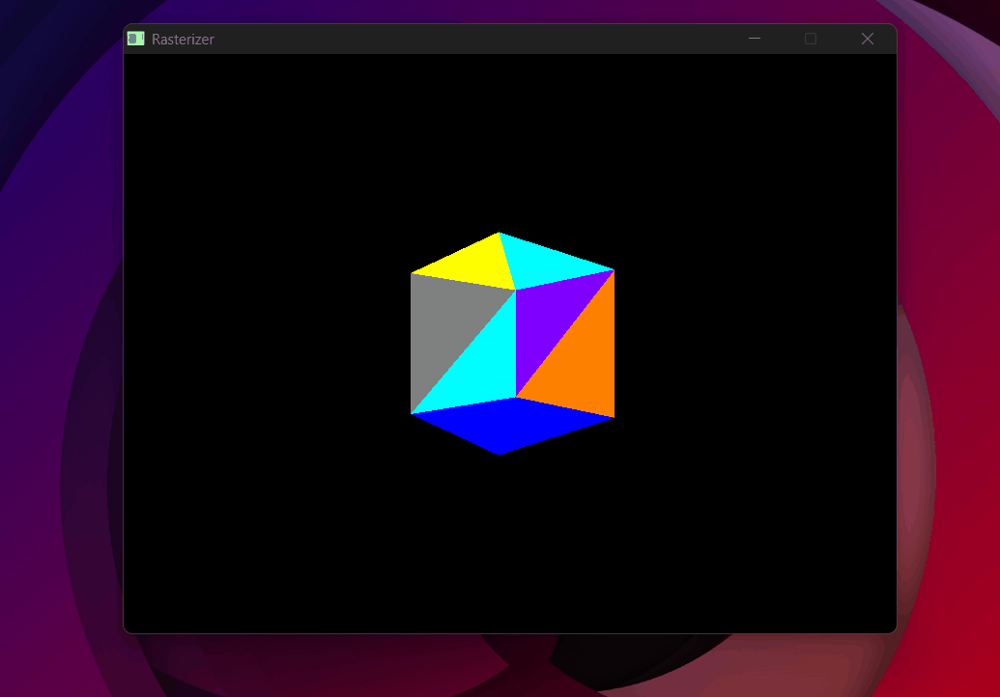
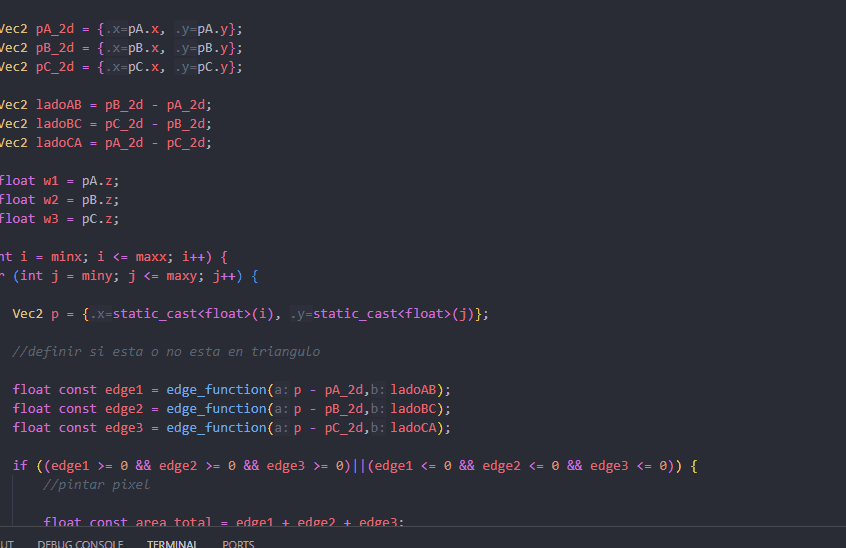
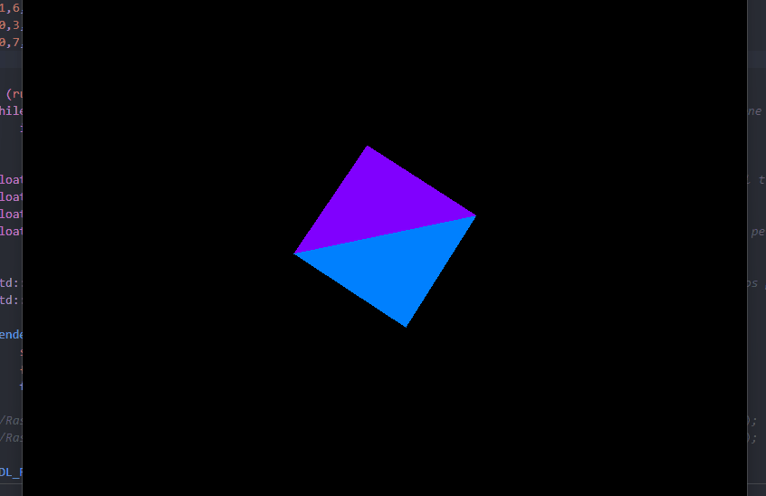

# 4×4 Matrices & the MVP Pipeline

<p class="subtitle">The longest day of the project — the heart of everything that follows.</p>

<div class="prereq-note">
  <span class="prereq-icon">📐</span>
  <span>Not familiar with vectors or matrices? <a href="../../extras/math_primer/">Read the Math Primer first</a> — it covers everything you need for this section.</span>
</div>

---

## The goal

Up to this point, triangles exist directly in screen coordinates. To render real 3D objects, vertices need to be transformed from 3D world space all the way to screen pixels. That journey requires three transformations chained together: <span class="accent-gold">**Model**, **View**, and **Projection**</span> — the MVP pipeline.

## Why 4×4 matrices

3D transformations like rotation and scale are <span class="accent-red">**linear transformations**</span> — functions T where:

\[ T(\mathbf{u} + \mathbf{v}) = T(\mathbf{u}) + T(\mathbf{v}) \qquad T(\alpha\mathbf{u}) = \alpha T(\mathbf{u}) \]

Linear transformations can be represented as matrix multiplications. But **translation is not linear** — if you translate a vector by t, you get v + t, and T(u + v) = u + v + t ≠ (u + t) + (v + t). It doesn't satisfy the first property. Even more tellingly: a linear transformation must map the origin to the origin, and translation obviously doesn't.

<span class="accent-red">So 3×3 matrices can't represent translation.</span> The solution is <span class="accent-gold">**homogeneous coordinates**</span>: add a 4th component w to every vector. For points, <span class="accent-sage">w = 1</span>. For directions, <span class="accent-sage">w = 0</span>.

\[ \mathbf{v}_{3D} = \begin{pmatrix} x \\ y \\ z \end{pmatrix} \quad \rightarrow \quad \mathbf{v}_{4D} = \begin{pmatrix} x \\ y \\ z \\ 1 \end{pmatrix} \]

With this extra dimension, translation can be encoded in the 4th column of a 4×4 matrix — and now every transformation, including translation, is a matrix multiplication. That's why 4×4.

```cpp
// Matrix-matrix multiplication
Mat4 Mat4::operator*(const Mat4& other) const {
    Mat4 result{};
    for (int i = 0; i < 4; i++)
        for (int j = 0; j < 4; j++)
            for (int k = 0; k < 4; k++)
                result.m[i*4+j] += m[i*4+k] * other.m[k*4+j];
    return result;
}

// Matrix-vector multiplication
Vec4 Mat4::operator*(const Vec4& v) const {
    return {
        m[0]*v.x + m[1]*v.y + m[2]*v.z + m[3]*v.w,
        m[4]*v.x + m[5]*v.y + m[6]*v.z + m[7]*v.w,
        m[8]*v.x + m[9]*v.y + m[10]*v.z + m[11]*v.w,
        m[12]*v.x + m[13]*v.y + m[14]*v.z + m[15]*v.w
    };
}
```

---

## Model matrix — transforming the object

The model matrix moves an object from its own local coordinate system into the **world space** — the shared coordinate system where all objects in the scene coexist. It's built by combining three individual transformations.

### Scale

<span class="accent-gold">Scale</span> multiplies each coordinate by a factor. For uniform scale k, the basis vectors just get stretched:

\[ S = \begin{pmatrix} k & 0 & 0 & 0 \\ 0 & k & 0 & 0 \\ 0 & 0 & k & 0 \\ 0 & 0 & 0 & 1 \end{pmatrix} \]

Multiplying a point (x, y, z, 1) by S gives (kx, ky, kz, 1). w stays 1.

```cpp
inline Mat4 scale_matrix(float k) {
    return { k,0,0,0,  0,k,0,0,  0,0,k,0,  0,0,0,1 };
}
```

### Translation

Translation adds an offset to each coordinate. With homogeneous coordinates, it fits cleanly in the 4th column:

\[ T = \begin{pmatrix} 1 & 0 & 0 & t_x \\ 0 & 1 & 0 & t_y \\ 0 & 0 & 1 & t_z \\ 0 & 0 & 0 & 1 \end{pmatrix} \]

Multiplying (x, y, z, 1) by T gives (x+tx, y+ty, z+tz, 1) — exactly the translation we want. This is why w = 1 for points: <span class="accent-sage">it activates the translation column</span>. For direction vectors (w = 0), translation is correctly ignored.

```cpp
inline Mat4 move_matrix(float x, float y, float z) {
    return { 1,0,0,x,  0,1,0,y,  0,0,1,z,  0,0,0,1 };
}
```

### Rotation

<span class="accent-gold">Rotation is where the geometry becomes interesting.</span> To build a rotation matrix, start with the 2D case: rotating the basis vector **e₁ = (1, 0)** by angle θ gives **(cos θ, sin θ)**. That's just the definition of cosine and sine on the unit circle. The rotated **e₂ = (0, 1)** gives **(-sin θ, cos θ)**.

Those rotated basis vectors become the <span class="accent-red">**columns** of the rotation matrix</span>. The interactive demo below shows exactly this:

<div class="viz-wrapper">
  <div class="viz-header">
    <span class="viz-label">● Interactive</span>
    <span class="viz-hint">drag θ to explore</span>
  </div>
  <iframe src="../../assets/viz/rotation_matrix.html" width="100%" height="380" frameborder="0"></iframe>
</div>

A matrix is a compact way of expressing what happens to each component of a vector separately — all at once. The animation above shows exactly this: rotating a point by θ produces two equations:

\[ x' = x \cdot \cos\theta - y \cdot \sin\theta \qquad y' = x \cdot \sin\theta + y \cdot \cos\theta \]

A matrix-vector multiplication works by dot-producting each row with the input vector. So if we pack those equations into rows:

- **Row 1** = [cos θ, −sin θ, 0, 0] · [x, y, z, 1] = x·cos θ − y·sin θ = x' ✓
- **Row 2** = [sin θ,  cos θ, 0, 0] · [x, y, z, 1] = x·sin θ + y·cos θ = y' ✓
- **Row 3** = [0, 0, 1, 0] · [x, y, z, 1] = z (unchanged) ✓

The matrix IS those equations — just packed into rows. For rotation around Z:

\[ R_z(\theta) = \begin{pmatrix} \cos\theta & -\sin\theta & 0 & 0 \\ \sin\theta & \cos\theta & 0 & 0 \\ 0 & 0 & 1 & 0 \\ 0 & 0 & 0 & 1 \end{pmatrix} \]

The first column is where X ends up, the second is where Y ends up. Z stays untouched. The same logic applies to Rx (rotating in the YZ plane) and Ry (rotating in the XZ plane), each leaving their respective axis fixed. The full model rotation is Rz · Ry · Rx — applied right to left.

```cpp
inline Mat4 roty_matrix(float angle) {
    return {
         cosf(angle), 0, sinf(angle), 0,
         0,           1, 0,           0,
        -sinf(angle), 0, cosf(angle), 0,
         0,           0, 0,           1,
    };
}
```

### Putting the model matrix together

Scale first, then rotate, then translate — <span class="accent-gold">order matters</span> because matrix multiplication is not commutative:

\[ M = T \cdot R_z \cdot R_y \cdot R_x \cdot S \]

```cpp
const Mat4 modelMatrix =
    move_matrix(move.x, move.y, move.z) *
    rotz_matrix(rotz) * roty_matrix(roty) * rotx_matrix(rotx) *
    scale_matrix(scale);
```

---

## View matrix — camera space

The view matrix transforms the world so that <span class="accent-red">the camera sits at the origin, looking down the −Z axis</span>. <span class="accent-sage">Everything else moves — not the camera.</span> Why −Z? By OpenGL convention, the camera looks "into" the screen, which is the negative Z direction.

<div class="viz-wrapper">
  <div class="viz-header">
    <span class="viz-label">● Interactive</span>
    <span class="viz-hint">toggle to see the transformation</span>
  </div>
  <iframe src="../../assets/viz/world_to_camera.html" width="100%" height="380" frameborder="0"></iframe>
</div>

Imagine the camera is at (−5, 0, 0) looking at the origin. We want to know where the world origin ends up in camera space. To place the camera at (−5, 0, 0), we translated it by −5 along X. To undo that for any world point, we do the opposite: translate by +5. The world origin goes from (0, 0, 0) to (5, 0, 0) — 5 units in front of the camera, which makes sense.

The pattern: whatever we did to place the camera in the world, we do the <span class="accent-red">opposite</span> to transform world points into camera space. And the matrix that does the opposite of another matrix is its <span class="accent-gold">inverse</span>.

In practice, placing the camera in the world involves two steps: rotate it to face the right direction, then translate it to its position. So the full camera-to-world transform is T × R, and the view matrix is its inverse: <span class="accent-gold">(T × R)⁻¹</span>.

**Step 1 — Compute the camera's three axes in world space.**

Forward (where the camera looks):

\[ \mathbf{f} = \text{normalize}(\text{center} - \text{eye}) \]


Right — perpendicular to forward. We use an artificial <span class="accent-sage">world up = (0, 1, 0)</span> as a reference, since we don't know the camera's up yet but we know the world's Y is "up":

\[ \mathbf{r} = \text{normalize}(\mathbf{f} \times \mathbf{up}_{world}) \]


Camera's true up — perpendicular to both:

\[ \mathbf{u} = \mathbf{r} \times \mathbf{f} \]


**Step 2 — Build the camera-to-world transform.**

Placing the camera in the world takes two steps: rotate first, then translate to eye:

\[ M_{cam} = T_{eye} \times R_{cam} \]

The translation matrix T simply puts the camera position in the 4th column:

\[ T_{eye} = \begin{pmatrix} 1 & 0 & 0 & \text{eye}_x \\ 0 & 1 & 0 & \text{eye}_y \\ 0 & 0 & 1 & \text{eye}_z \\ 0 & 0 & 0 & 1 \end{pmatrix} \]


The rotation matrix R answers: <span class="accent-gold">where does each camera axis point in world space?</span>

The camera's X axis is the standard basis vector e₁ = (1, 0, 0). When you multiply a matrix R by e₁, the result is always the first column of R — because all other terms cancel out. So the first column of R directly controls where the camera's X axis ends up in the world. If we want it to point in direction **r**, we set the first column to **r**. The same logic applies to the camera's Y axis (e₂ → second column = **u**) and Z axis (e₃ → third column = **f**):

\[ R_{cam} = \begin{pmatrix} r_x & u_x & f_x & 0 \\ r_y & u_y & f_y & 0 \\ r_z & u_z & f_z & 0 \\ 0 & 0 & 0 & 1 \end{pmatrix} \]

**Step 3 — Invert.**


\[ V = (T_{eye} \times R_{cam})^{-1} = R_{cam}^{-1} \times T_{eye}^{-1} \]


<span class="accent-red">T⁻¹</span> is straightforward: same matrix, but negate the translation (replace eye with −eye).

<span class="accent-red">R⁻¹</span> is elegant: since **r**, **u**, **f** are orthonormal (unit vectors, mutually perpendicular), R is orthogonal. For orthogonal matrices, <span class="accent-gold">the inverse equals the transpose</span> — rows and columns swap. The columns of R (which were **r**, **u**, **f**) become its rows.

Multiplying R^T × T⁻¹ and combining gives the final view matrix:

\[ V = \begin{pmatrix} r_x & r_y & r_z & -(\mathbf{r} \cdot \text{eye}) \\ u_x & u_y & u_z & -(\mathbf{u} \cdot \text{eye}) \\ f_x & f_y & f_z & -(\mathbf{f} \cdot \text{eye}) \\ 0 & 0 & 0 & 1 \end{pmatrix} \]


```cpp
inline Mat4 lookAt_matrix(Vec3 eye, Vec3 center) {
    Vec3 forward = (center - eye).normalize();
    Vec3 right   = forward.cross(temp_up).normalize();
    Vec3 up      = right.cross(forward);

    return {
        right.x,   right.y,   right.z,   -(right * eye),
        up.x,      up.y,      up.z,      -(up * eye),
        forward.x, forward.y, forward.z, -(forward * eye),
        0,         0,         0,          1
    };
}
```

---

## Projection matrix — perspective

The projection matrix maps the camera's <span class="accent-red">**frustum**</span> — the truncated pyramid of everything visible, bounded by a near plane and a far plane — into <span class="accent-gold">**clip space**</span>. Clip space is an intermediate 4D space that keeps the original depth (w) intact before dividing by it. This is useful for clipping: a point is inside the view frustum if −w ≤ x ≤ w, −w ≤ y ≤ w, and −w ≤ z ≤ w — no division needed. After clipping, we divide by w to get <span class="accent-sage">NDC</span>.

**How focal length relates to FOV.** Before building the matrix, we need a way to scale points onto the image plane. The demo below shows the geometry:

<div class="viz-wrapper">
  <div class="viz-header">
    <span class="viz-label">● Interactive</span>
    <span class="viz-hint">drag FOV to see how the image plane scales</span>
  </div>
  <iframe src="../../assets/viz/focal_length.html" width="100%" height="380" frameborder="0"></iframe>
</div>

**Focal length from FOV.** In the image plane, we want points to map to NDC y ∈ [-1, 1]. A point at depth z with height y projects to:

\[ y_{\text{proj}} = \frac{f \cdot y}{z} \]

For this to land in [-1, 1], we want f to make the half-height of the frustum at distance f equal to 1. That gives:

\[ \tan\left(\frac{\text{FOV}}{2}\right) = \frac{1}{f} \quad \Rightarrow \quad f = \frac{1}{\tan(\text{FOV}/2)} \]

X gets divided by the aspect ratio to correct for non-square screens.

**Storing z in w.** Matrix multiplication is a linear operation — it can only add and scale values. Dividing by z (which is what perspective requires) is non-linear: you can't express it as a matrix. The solution: store z in the w component using the `1` in position [3,2], so that after the multiplication w = z. Then we do the division manually — that's the perspective divide. The third row has two values left to determine, A and B:

\[ P = \begin{pmatrix} f/\text{aspect} & 0 & 0 & 0 \\ 0 & f & 0 & 0 \\ 0 & 0 & A & B \\ 0 & 0 & 1 & 0 \end{pmatrix} \]

Multiplying this by a vertex (x, y, z, 1) gives clip space (fx/aspect, fy, Az+B, z). After dividing by w = z, the z component becomes:

\[ z_{\text{ndc}} = \frac{A \cdot z + B}{z} \]

We want this to map near → −1 and far → +1:

\[ \frac{A \cdot \text{near} + B}{\text{near}} = -1 \quad \Rightarrow \quad A \cdot \text{near} + B = -\text{near} \quad (1) \]

\[ \frac{A \cdot \text{far} + B}{\text{far}} = +1 \quad \Rightarrow \quad A \cdot \text{far} + B = \text{far} \quad (2) \]

Subtracting (1) from (2): A(far − near) = far + near, so:

\[ A = \frac{\text{near}+\text{far}}{\text{far}-\text{near}} \]

Substituting back into (1):

\[ B = \frac{2 \cdot \text{near} \cdot \text{far}}{\text{near}-\text{far}} \]

Replacing A and B, the full projection matrix is:

\[ P = \begin{pmatrix} f/\text{aspect} & 0 & 0 & 0 \\ 0 & f & 0 & 0 \\ 0 & 0 & \frac{n+f}{f-n} & \frac{2nf}{n-f} \\ 0 & 0 & 1 & 0 \end{pmatrix} \]

The last row stores the original z into w — that's what makes the perspective divide work.

<div class="viz-wrapper">
  <div class="viz-header">
    <span class="viz-label">● Interactive</span>
    <span class="viz-hint">step through how the frustum transforms into clip space</span>
  </div>
  <iframe src="../../assets/viz/projection_matrix.html" width="100%" height="580" frameborder="0"></iframe>
</div>

```cpp
inline Mat4 projection_matrix(float fov, float aspect, float near, float far) {
    const float f = 1.0f / tanf(radianes(fov) / 2.0f);
    return {
        f/aspect, 0,  0,                         0,
        0,        f,  0,                         0,
        0,        0,  (near+far)/(far-near),     2*(near*far)/(near-far),
        0,        0,  1,                         0
    };
}
```

---

## Perspective divide & viewport transform

After multiplying by MVP, each vertex is in **clip space** — a 4D vector (x, y, z, w) where w holds the original depth. Dividing everything by w gives **NDC** (Normalized Device Coordinates), where every visible point is in the cube [-1, 1]³:

\[ \text{NDC} = \left(\frac{x_c}{w_c},\; \frac{y_c}{w_c},\; \frac{z_c}{w_c}\right) \]

<span class="accent-red">This division is what produces perspective</span> — far objects have larger w, so dividing by it makes them appear smaller.

```cpp
Vec3 ndc = {clip.x/clip.w, clip.y/clip.w, clip.z/clip.w};
```

The viewport transform maps NDC to pixel coordinates. NDC x lives in [−1, 1]. <span class="accent-gold">Adding 1</span> shifts it to [0, 2]. Dividing by 2 gives [0, 1]. Multiplying by (W−1) gives [0, W−1] — exactly the screen pixel range. Y is flipped because <span class="accent-sage">NDC +Y is up but screen +Y is down</span>: we use (1 − ndc_y) instead of (1 + ndc_y) to flip the axis.

\[ \text{screen}_x = \frac{(1 + \text{ndc}_x)(W-1)}{2} \qquad \text{screen}_y = \frac{(1 - \text{ndc}_y)(H-1)}{2} \]

<div class="viz-wrapper">
  <div class="viz-header">
    <span class="viz-label">● Interactive</span>
    <span class="viz-hint">see how NDC coordinates map to screen pixels</span>
  </div>
  <iframe src="../../assets/viz/viewport_transform.html" width="100%" height="380" frameborder="0"></iframe>
</div>

```cpp
Vec2 screen = {
    (1 + ndc.x) * (WIDTH  - 1) / 2,
    (1 - ndc.y) * (HEIGHT - 1) / 2  // Y flipped: NDC +Y is up, screen +Y is down
};
```

---

## Putting it all together

The MVP matrix chains all three transformations. Applied <span class="accent-gold">right to left</span> — scale and rotate first, then position in the world, then to camera space, then project:

\[ \text{MVP} = P \cdot V \cdot M \]

```cpp
const Mat4 MVP =
    projection_matrix(fov, (float)WIDTH/HEIGHT, near, far) *     // P
    lookAt_matrix(eye, center) *                                  // V
    move_matrix(move.x, move.y, move.z) *                        // M: translate
    rotz_matrix(rotz) * roty_matrix(roty) * rotx_matrix(rotx) * // M: rotate
    scale_matrix(scale);                                          // M: scale

// Every vertex goes through the full pipeline:
Vec4 clip   = MVP * Vec4{ver.x, ver.y, ver.z, 1.0f};
Vec3 ndc    = {clip.x/clip.w, clip.y/clip.w, clip.z/clip.w};
Vec2 screen = {(1+ndc.x)*(WIDTH-1)/2, (1-ndc.y)*(HEIGHT-1)/2};
```

In the rasterizer, this runs for every vertex of every triangle, every frame. The screen-space positions go into the bounding box and edge function tests from the previous sections — the pipeline connects directly to the pixel loop.

---

## Bugs

<div class="bug-card">
  <div class="bug-header">
    <span class="bug-tag">BUG</span>
    <span class="bug-title">Cube moves in the direction it rotates — MVP applied in reverse</span>
  </div>
  <div class="bug-body">
    <div class="bug-row">
      <span class="bug-label">What happened</span>
      <span>Moving the cube in Z sent it flying in the wrong direction depending on its rotation. Everything was distorted and unpredictable.</span>
    </div>
    <div class="bug-row">
      <span class="bug-label">Cause</span>
      <span>The MVP matrix was being applied in the wrong order — projection was the first transformation applied, not the last. Since matrix multiplication reads right to left, the code had it completely backwards.</span>
    </div>
    <div class="bug-row">
      <span class="bug-label">Fix</span>
      <span>Reverse the multiplication order: <code>P × V × M</code>. The vertex experiences scale, then rotation, then translation, then view, then projection — in that sequence.</span>
    </div>
  </div>
</div>

<div class="bug-card">
  <div class="bug-header">
    <span class="bug-tag">BUG</span>
    <span class="bug-title">Epileptic cube — random color every frame, interior faces visible</span>
  </div>
  <div class="bug-body">
    <div class="bug-row">
      <span class="bug-label">What happened</span>
      <span>The cube was flickering with completely random colors every frame, and the interior faces were visible through the exterior.</span>
    </div>
    <div class="bug-row">
      <span class="bug-label">Cause</span>
      <span>Two problems at once. First, a random color was being assigned per triangle per frame — no fixed color, just noise. Second, the z-buffer depth values had the wrong sign: <code>−w</code> was being stored instead of <code>+w</code>, so the depth test was inverted and back faces were drawing over front faces.</span>
    </div>
    <div class="bug-row">
      <span class="bug-label">Fix</span>
      <span>Assign a fixed color per face. Fix the sign of w in the depth value — store <code>+w</code> so the depth test correctly picks the nearest surface.</span>
    </div>
  </div>
</div>

{ .page-img }
<p class="img-caption">Random color per triangle per frame + no backface culling = chaos.</p>

<div class="bug-card">
  <div class="bug-header">
    <span class="bug-tag">BUG</span>
    <span class="bug-title">Abstract art — renderer not cleared between frames</span>
  </div>
  <div class="bug-body">
    <div class="bug-row">
      <span class="bug-label">What happened</span>
      <span>Rotating and moving the cube produced a beautiful abstract painting — every frame's output was layered on top of the previous ones.</span>
    </div>
    <div class="bug-row">
      <span class="bug-label">Cause</span>
      <span>The framebuffer and z-buffer were being cleared each frame, but <code>SDL_RenderClear</code> was not being called. SDL's renderer kept the previous frame's content painted on screen underneath the new one.</span>
    </div>
    <div class="bug-row">
      <span class="bug-label">Fix</span>
      <span>Add <code>SDL_RenderClear(renderer)</code> at the start of every frame. One line.</span>
    </div>
  </div>
</div>

{ .page-img }
<p class="img-caption">Not clearing the renderer — every frame painted on top of the last.</p>

---

## Result

{ .page-img }
<p class="img-caption">The cube fully colored and rotating — model, view, and projection all working together.</p>

With the MVP pipeline working, 3D objects can be positioned, oriented, and projected correctly onto the screen. The next step is loading real objects from files — the OBJ parser.

<div class="page-nav">
  <a href="../03_zbuffer/" class="page-nav-btn prev">← Z-Buffer</a>
  <a href="../05_parser/" class="page-nav-btn next">OBJ Parser →</a>
</div>