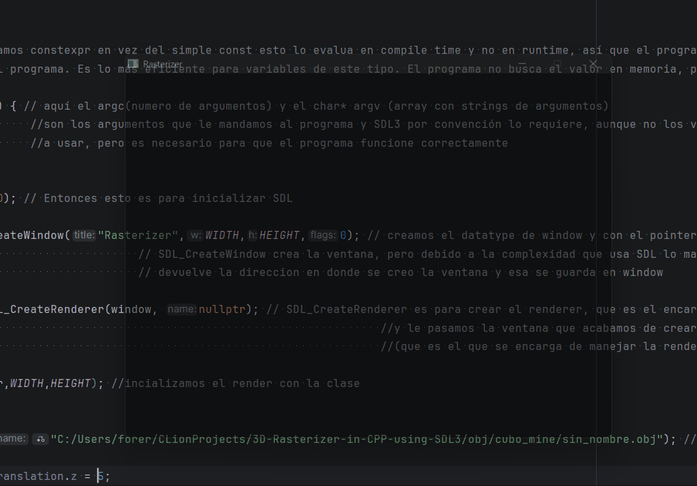

# OBJ & BMP Parser

<p class="subtitle">Loading real 3D objects from files — no libraries, just file reading.</p>

---

## The goal

Up to this point, objects were cubes defined by hand with hardcoded vertices. To render real models, we need to read them from files. The standard format for geometry is <span class="accent-gold">`.obj`</span> paired with <span class="accent-gold">`.mtl`</span> for material definitions. For textures, I chose <span class="accent-sage">`.bmp`</span> — a simple binary format with no compression, far easier to parse from scratch than PNG or JPEG — <span class="accent-sage">no compression, no color space transformations, just raw bytes</span>.

## The OBJ format

An `.obj` file is plain text. Each line starts with a keyword that tells you what kind of data follows:

```
v   0.5  1.0 -0.3       # vertex position
vt  0.25 0.75           # UV coordinate
vn  0.0  1.0  0.0       # normal vector
f   1/1/1 2/2/2 3/3/3   # face: v/vt/vn indices per vertex
```

Face indices start at <span class="accent-red">**1, not 0**</span> — that's the OBJ convention. Each `v/vt/vn` group references a vertex position, a UV coordinate, and a normal.

## Parsing line by line

The parser reads the file line by line with `std::getline`, then reads each line **token by token** using `std::istringstream`. A <span class="accent-gold">token</span> is any string of characters separated by spaces — `>>` reads one token at a time:

```cpp
std::ifstream objeto(filename);
std::string line;

while (std::getline(objeto, line)) {
    std::istringstream iss(line);
    std::string word;
    iss >> word;  // first token — the keyword ("v", "vt", "f", etc.)

    if (word == "v") {
        iss >> word; float v1 = std::stof(word);
        iss >> word; float v2 = std::stof(word);
        iss >> word; float v3 = std::stof(word);
        vertices.push_back({v1, v2, v3});
    }
    if (word == "vt") { /* same for UV coords */ }
    if (word == "vn") { /* same for normals   */ }
    if (word == "f")  { /* parse face indices */ }
}
```

For faces, each group `1/2/3` needs a second `istringstream` using `/` as the delimiter:

```cpp
while (iss >> token) {
    std::istringstream iss2(token);
    std::string index;

    std::getline(iss2, index, '/');  // vertex index
    face.v_indices.push_back(std::stoi(index));

    std::getline(iss2, index, '/');  // UV index
    face.uv_indices.push_back(std::stoi(index));

    std::getline(iss2, index);       // normal index
    face.n_indices.push_back(std::stoi(index));
}
```

## Fan triangulation

OBJ files can have faces with more than 3 vertices — quads, pentagons, anything. The rasterizer only handles triangles. The solution is <span class="accent-gold">**fan triangulation**</span>: pick the first vertex as a fixed anchor, then connect it to each consecutive pair of the remaining vertices:

```cpp
for (int i = 1; i < face.v_indices.size() - 1; i++) {
    // triangle: vertex 0, vertex i, vertex i+1
    Vec3 v1 = vertices[face.v_indices[0] - 1];   // -1: OBJ indices start at 1
    Vec3 v2 = vertices[face.v_indices[i] - 1];
    Vec3 v3 = vertices[face.v_indices[i+1] - 1];
}
```

## The MTL file

The `.mtl` file accompanies the `.obj` and defines <span class="accent-gold">the material properties</span> for each named surface — including the path to the texture image and the Phong constants:

```
newmtl skull_texture
map_Kd textures/skull.bmp   # path to diffuse texture
Ns  96.0                     # shininess
Ka  0.1 0.1 0.1             # ambient color
Kd  0.8 0.8 0.8             # diffuse color
Ks  0.5 0.5 0.5             # specular color
```

The parser reads the MTL to find the texture path for each material name, then loads the corresponding BMP. Each face in the OBJ references a material by name — that's how the renderer knows which texture to sample for each triangle.

## The BMP parser

<span class="accent-red">BMP is a binary format</span> — you can't read it line by line. The file starts with a **header** that contains metadata at fixed byte positions:

- **Bytes 10–13**: offset where the pixel data starts
- **Bytes 18–21**: image width
- **Bytes 22–25**: image height

These values are stored in <span class="accent-gold">**little-endian**</span> format — <span class="accent-sage">the least significant byte comes first</span>. To read a 4-byte integer, you need to combine the bytes manually:

```cpp
uint32_t start =
    static_cast<uint8_t>(buffer[10]) |
    (static_cast<uint8_t>(buffer[11]) << 8)  |
    (static_cast<uint8_t>(buffer[12]) << 16) |
    (static_cast<uint8_t>(buffer[13]) << 24);
```

Each byte is shifted into its correct position and OR'd together. Without the `uint8_t` cast, <span class="accent-red">sign extension would corrupt the higher bits</span>.

Three quirks of the BMP format:

- Colors are stored in <span class="accent-red">**BGR** order, not RGB</span>
- Rows are stored <span class="accent-gold">**bottom to top**</span> — the first row in the file is the last row of the image
- Each row is padded to a **multiple of 4 bytes**

```cpp
int padding = (4 - ((width * 3) % 4)) % 4;

for (int j = height - 1; j >= 0; j--) {       // bottom to top
    for (int i = 0; i < width * 3; i += 3) {  // 3 bytes per pixel (BGR)
        int idx = j * (width * 3 + padding) + i + start;
        colores[(height-1-j) * width + i/3].b = buffer[idx];
        colores[(height-1-j) * width + i/3].g = buffer[idx + 1];
        colores[(height-1-j) * width + i/3].r = buffer[idx + 2];
    }
}
```

The result is stored in a `std::vector<Col>` of size `width × height` — a flat array of RGB pixels, exactly like the framebuffer but for the texture. <span class="accent-sage">This vector is what the rasterizer samples</span> when it needs the color at a given UV coordinate.

---

## Bugs

<div class="bug-card">
  <div class="bug-header">
    <span class="bug-tag">BUG</span>
    <span class="bug-title">Nothing renders — black window</span>
  </div>
  <div class="bug-body">
    <div class="bug-row">
      <span class="bug-label">What happened</span>
      <span>The window opened but showed nothing. The model wasn't loading at all.</span>
    </div>
    <div class="bug-row">
      <span class="bug-label">Cause</span>
      <span>The <span class="accent-red">working directory</span> — the folder CLion uses as the base for relative paths — wasn't set to the project root. So <code>obj/skull/model.obj</code> resolved to a path that didn't exist. <span class="accent-red">This is a common pitfall when opening files with relative paths:</span> the program runs fine in the IDE but can't find anything because it's looking in the wrong place.</span>
    </div>
    <div class="bug-row">
      <span class="bug-label">Fix</span>
      <span>Set the working directory explicitly in CLion's run configuration to the project root. All relative paths then resolve correctly.</span>
    </div>
  </div>
</div>

<div class="bug-card">
  <div class="bug-header">
    <span class="bug-tag">BUG</span>
    <span class="bug-title">Textures completely broken — geometry destroyed</span>
  </div>
  <div class="bug-body">
    <div class="bug-row">
      <span class="bug-label">What happened</span>
      <span>The model loaded but the geometry was completely distorted — vertices in the wrong places, faces twisted.</span>
    </div>
    <div class="bug-row">
      <span class="bug-label">Cause</span>
      <span><span class="accent-gold">OBJ indices start at 1, C++ vectors start at 0.</span> Accessing <code>vertices[index]</code> without subtracting 1 reads the wrong vertex every time.</span>
    </div>
    <div class="bug-row">
      <span class="bug-label">Fix</span>
      <span><code>vertices[face.v_indices[i] - 1]</code> — subtract 1 from every index when accessing the arrays.</span>
    </div>
  </div>
</div>

{ .page-img }
<p class="img-caption">Wrong vertex indices — geometry completely distorted.</p>

---

## Result

The visual results of the parser — the Minecraft cube with texture — appear in the next section, UV Texturing, where sampling the texture is fully implemented.

<div class="page-nav">
  <a href="../04_matrices/" class="page-nav-btn prev">← Matrices & MVP</a>
  <a href="../06_uv/" class="page-nav-btn next">UV Texturing →</a>
</div>