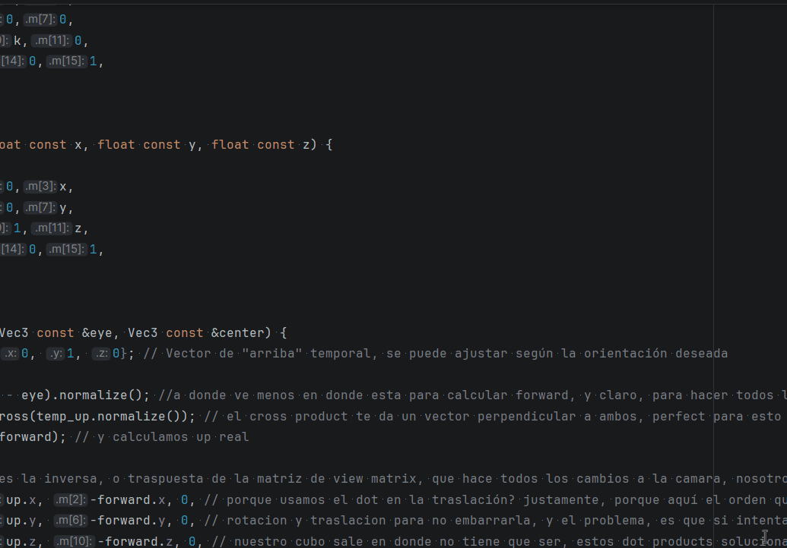
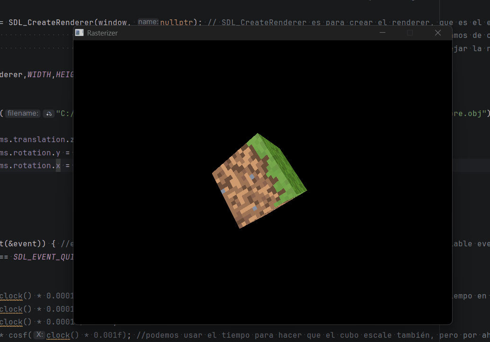
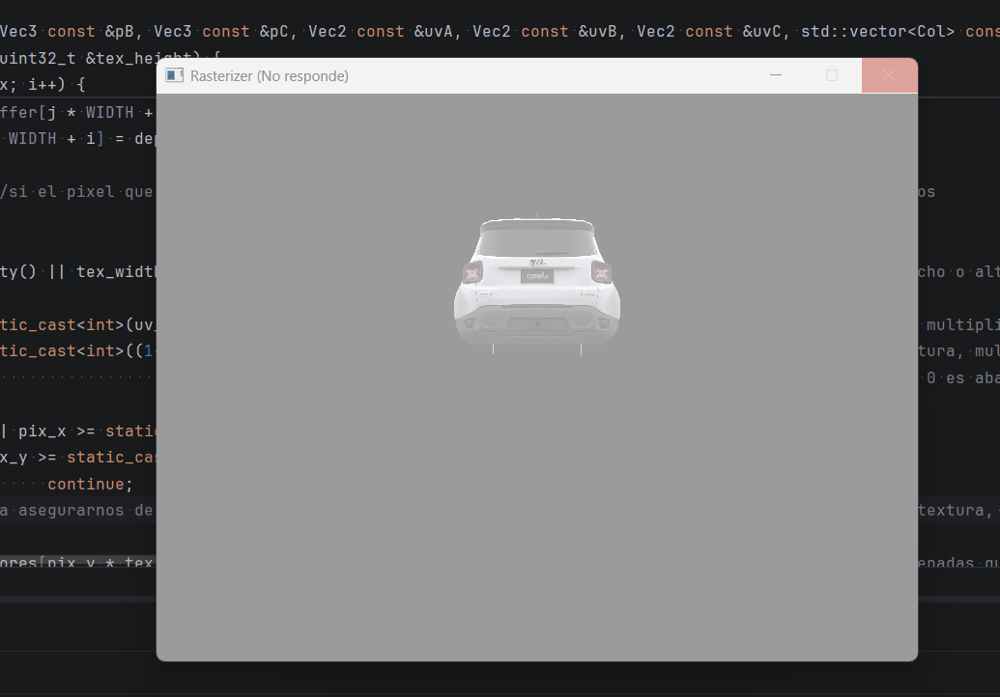
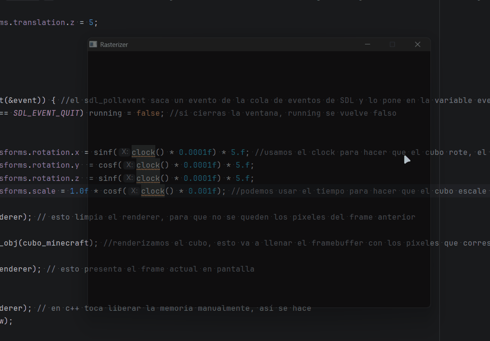

# UV Texturing & Perspective-Correct Interpolation

<p class="subtitle">From solid colors to textured surfaces — and why naive interpolation breaks.</p>

---

## The goal

With the parser ready, the next step is mapping textures onto triangles. <span class="accent-gold">UV coordinates</span> define which part of the texture belongs to each vertex. <span class="accent-sage">Interpolating those coordinates</span> across every pixel fills the surface correctly. Two steps — but the second one hides a non-obvious problem.

## UV coordinates

Every vertex in a model has associated UV coordinates — <span class="accent-gold">two values between 0 and 1</span> that point to a position in texture space. U is the horizontal axis, V is vertical. (0, 0) is the bottom-left corner of the texture, (1, 1) is the top-right.

<div class="viz-wrapper">
  <div class="viz-header">
    <span class="viz-label">● Interactive</span>
    <span class="viz-hint">drag UV handles to see how the texture maps onto the mesh</span>
  </div>
  <iframe src="../../assets/viz/uv_mapping.html" width="100%" height="380" frameborder="0"></iframe>
</div>

To get the color of a pixel, interpolate its UV coordinates using barycentric weights, then convert to a pixel position in the texture image.

Note: this is the **naive** linear interpolation — it works for flat surfaces but breaks with perspective. The fix comes in the next section.

```cpp
// ⚠ Naive linear interpolation — breaks with perspective
Vec2 uv = uvC * e1_norm + uvA * e2_norm + uvB * e3_norm;

// Convert UV [0,1] to pixel coordinates in the texture
int pix_x = static_cast<int>(uv.x * (tex_width  - 1));
int pix_y = static_cast<int>((1 - uv.y) * (tex_height - 1));
// (1 - uv.y): BMP stores rows bottom-to-top, screen pixel 0 is at the top

// Sample the color
Col color = texture[pix_y * tex_width + pix_x];
```

{ .page-img }
<p class="img-caption">First clean texture on a static mesh — no perspective correction yet, but it works for flat views.</p>

---

## Why linear interpolation breaks

Direct barycentric interpolation works fine for 2D colors. But for 3D textures, it fails — and <span class="accent-red">the reason is perspective</span>.

When a 3D triangle is projected onto the screen, <span class="accent-red">far vertices appear smaller</span> — the further away, the less screen space they occupy. The pixel distances between vertices on screen are no longer proportional to their actual 3D distances. Interpolating UV linearly in screen space assumes all vertices are at the same depth — which is false.

The result: textures stretch and warp as the surface rotates.

<div class="viz-wrapper">
  <div class="viz-header">
    <span class="viz-label">● Interactive</span>
    <span class="viz-hint">compare linear vs perspective-correct interpolation</span>
  </div>
  <iframe src="../../assets/viz/perspective_correct.html" width="100%" height="380" frameborder="0"></iframe>
</div>

{ .page-img }
<p class="img-caption">Textures in place but distorted — linear interpolation ignores depth.</p>

---

## The fix — perspective-correct interpolation

The key insight: <span class="accent-gold">1/w is linear in screen space</span>, even though w itself is not. This means instead of interpolating an attribute A directly, we interpolate A/w — and then multiply by the interpolated w to get the correct value back.

In practice it's three steps:

1. Divide each attribute by its vertex's w before interpolating
2. Interpolate the divided values using barycentric weights
3. Multiply the result by the interpolated w (computed by interpolating 1/w and inverting it)

In code:

```cpp
// w1, w2, w3 = original depth of each vertex before perspective divide
float depth = e1_norm*(1/w3) + e2_norm*(1/w1) + e3_norm*(1/w2);
depth = 1/depth;  // this is our interpolated w — used for depth test too

// Perspective-correct UV interpolation
Vec2 uv_coor = uvC*(e1_norm/w3) + uvA*(e2_norm/w1) + uvB*(e3_norm/w2);
uv_coor = uv_coor * depth;  // multiply by w to undo the 1/w division
```

The same formula applies to normals and any other per-vertex attribute that needs to be interpolated correctly across depth.

---

## Bug — copying the texture every frame

<div class="bug-card">
  <div class="bug-header">
    <span class="bug-tag">BUG</span>
    <span class="bug-title">Importing a detailed model crashes the window</span>
  </div>
  <div class="bug-body">
    <div class="bug-row">
      <span class="bug-label">What happened</span>
      <span>Loading a more complex model — a low-poly Jeep instead of the Minecraft cube — caused the window to freeze immediately and crash.</span>
    </div>
    <div class="bug-row">
      <span class="bug-label">Cause</span>
      <span>The texture (over a million pixels, each with multiple bytes of color data) was being <span class="accent-red">copied entirely on every single frame</span>. The Minecraft cube's tiny texture hid this problem. A larger texture exposed it immediately.</span>
    </div>
    <div class="bug-row">
      <span class="bug-label">Fix</span>
      <span>Pass the material by <code>const*</code> pointer instead of by value. The rasterizer now holds a pointer to the texture — 8 bytes — instead of copying megabytes of pixel data every frame.</span>
    </div>
  </div>
</div>

{ .page-img }
<p class="img-caption">Importing a more detailed model immediately crashes — copying the texture every frame doesn't scale.</p>

---

## Result

{ .page-img }
<p class="img-caption">Perspective-correct UV interpolation — the texture stays consistent as the mesh rotates.</p>

With textures working correctly, the next step is cutting down unnecessary work: backface culling, frustum culling, and multithreading.

<div class="page-nav">
  <a href="../05_parser/" class="page-nav-btn prev">← OBJ Parser</a>
  <a href="../07_culling/" class="page-nav-btn next">Culling & Optimizations →</a>
</div>