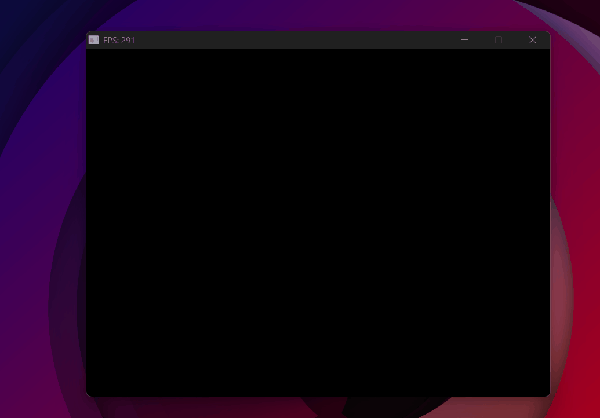

# Culling & Optimizations

<p class="subtitle">Skipping work the camera can't see — and parallelizing what remains.</p>

---

## The problem

With a model loaded and textured, the next bottleneck is obvious: the rasterizer processes triangles the user will never see. <span class="accent-red"><span class="accent-red">Triangles facing away from the camera</span>, <span class="accent-red">triangles outside the field of view</span>, and pixels computed one at a time on a single CPU core.</span> Three optimizations fix most of this.

## Backface culling

Any closed solid object has two kinds of triangles: those facing toward the camera (**frontfaces**) and those facing away (**backfaces**). Backfaces are always hidden behind the frontfaces of the same object — <span class="accent-gold">they can never be visible</span>. Discarding them before rasterizing <span class="accent-gold">cuts roughly half the work</span>.

The way to detect them comes directly from the edge function. When we compute the edge function for a triangle's three vertices in screen space, the **sign of the result** tells us the winding order — the direction in which the vertices are laid out. Counter-clockwise means the triangle faces toward the camera. Clockwise means it faces away.

In the rasterizer, we already use the edge function to compute barycentric coordinates. The total area it produces has a sign:

- <span class="accent-sage">Negative area → counter-clockwise → frontface → render</span>
- <span class="accent-red">Positive area → clockwise → backface → discard</span>

```cpp
// Signed area of the triangle in screen space
float area = edge_function(real2 - real1, real3 - real1);
if (area >= 0) continue; // clockwise = backface — skip
```

## Frustum culling

Even with backface culling, many triangles fall outside the camera's field of view. Rasterizing them is <span class="accent-red">pure wasted work</span>.

The test happens in <span class="accent-gold">clip space</span> — before the perspective divide. Recall from the projection matrix section: after multiplying by the MVP, each vertex has a w component equal to its original depth. A vertex is inside the frustum if its x, y, and z are all between −w and +w. If all three vertices of a triangle exceed that range on the same side, the whole triangle is off-screen:

```cpp
// All three vertices beyond the same frustum plane → discard
if (v1.x < -v1.w && v2.x < -v2.w && v3.x < -v3.w) continue; // left
if (v1.x >  v1.w && v2.x >  v2.w && v3.x >  v3.w) continue; // right
if (v1.y < -v1.w && v2.y < -v2.w && v3.y < -v3.w) continue; // bottom
if (v1.y >  v1.w && v2.y >  v2.w && v3.y >  v3.w) continue; // top
```

Why ±w? Because after the perspective divide, NDC x = x_clip / w. For a point to be inside the screen, NDC x must be in [−1, 1], which means x_clip / w ∈ [−1, 1], which means <span class="accent-sage">−w ≤ x_clip ≤ w</span>. <span class="accent-sage">Checking this in clip space avoids the division entirely.</span>

> **Note:** the same test applies to Z — clipping triangles that are entirely behind the near plane or beyond the far plane. This wasn't implemented here since none of the test scenes involved objects at extreme depth ranges, but it follows the exact same logic as the X/Y checks above.

## Multithreading

Backface and frustum culling reduce the number of triangles to process. But the rasterization of the remaining triangles is still sequential — one pixel at a time, on a single CPU core.

Modern CPUs have multiple cores — independent processing units that can execute code simultaneously. Instead of using just one, we can split the work across all of them. The solution: <span class="accent-gold">divide the framebuffer into horizontal strips</span> and assign each strip to a different thread. Each thread rasterizes its own rows in parallel, independently, without interfering with the others.

<div class="viz-wrapper">
  <div class="viz-header">
    <span class="viz-label">● Interactive</span>
    <span class="viz-hint">drag the cores slider to see the framebuffer split</span>
  </div>
  <iframe src="../../assets/viz/multithreading.html" width="100%" height="380" frameborder="0"></iframe>
</div>

**Step 1 — Divide the framebuffer into strips.** Before launching any threads, we precompute the row range each thread will own. Each strip covers `rows_per_thread` rows, and the last one absorbs any remainder:

\[ 	ext{strip}_i = [\, i \cdot 	ext{lpt},\; (i+1) \cdot 	ext{lpt} - 1 \,] \]

```cpp
unsigned int num_cores  = std::thread::hardware_concurrency();
int lines_per_thread    = HEIGHT / num_cores;
int remainder           = HEIGHT % num_cores;

for (int i = 0; i < num_cores; i++) {
    threads.push_back({ i * lines_per_thread,
                        (i + 1) * lines_per_thread - 1 });
}
threads.back().y += remainder; // last strip absorbs leftover rows
```

Each entry in `threads` is a `{x, y}` pair — the first and last row of that thread's strip.

**Step 2 — Spawn and join.** Each thread calls `Rasterize_threads` with its own row range (`t.x` → start row, `t.y` → end row). The rasterizer only writes pixels within those rows, so <span class="accent-sage">threads never touch each other's memory</span>.

```cpp
for (auto& t : threads) {
    threads_list.push_back(
        std::thread(&Render::Rasterize_threads, this,
                    std::ref(triangulos), t.x, t.y)
    );
}

for (auto& t : threads_list) {
    t.join(); // wait for all threads before presenting the frame
}
```

Here are all the optimizations paying off — the Jeep at ~300 FPS stable:

{ .page-img }
<p class="img-caption">From nearly unusable with complex models to ~300 FPS — backface culling, frustum culling, and multithreading combined.</p>

---

## Result

With these three optimizations chained together, the rasterizer goes from <span class="accent-red">struggling with complex models</span> to <span class="accent-gold">running at hundreds of FPS</span>. The next step is giving the camera free movement — WASD and mouse look.

<div class="page-nav">
  <a href="../06_uv/" class="page-nav-btn prev">← UV Texturing</a>
  <a href="../08_camera/" class="page-nav-btn next">Camera →</a>
</div>