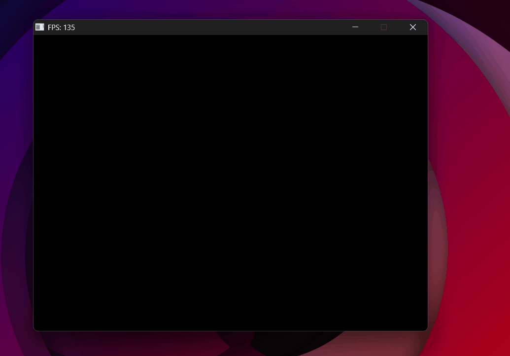

# Free Camera — WASD & Mouse Look

<p class="subtitle">Moving through the scene — yaw, pitch, and a bug that made the world spin.</p>

---

## The goal

Up to this point the camera was fixed. The next step is free movement: WASD to translate, mouse to rotate.

The `lookAt` function from the matrices section takes two things — an eye position and a target point — and builds the view matrix from them. To move the camera, all we need is to <span class="accent-gold">update those values every frame</span>: move the eye position with WASD, and compute a new target point based on where the camera is pointing.

That direction the camera points is the **`front` vector** — a unit vector from the camera's position toward its target. Every frame, we compute `front` from the camera's current orientation, then pass `eye` and `eye + front` to `lookAt`.

## Yaw and pitch

Rather than storing `front` directly — which is hard to control interactively — we store two angles that describe the camera's orientation:

- <span class="accent-gold">**Yaw (θ)**</span> — rotation around the Y axis. How far left or right the camera faces.
- <span class="accent-gold">**Pitch (φ)**</span> — rotation around the X axis. How far up or down the camera looks.

<div class="viz-wrapper">
  <div class="viz-header">
    <span class="viz-label">● Interactive</span>
    <span class="viz-hint">drag the sliders to see yaw and pitch in action</span>
  </div>
  <iframe src="../../assets/viz/pitch_yaw_roll.html" width="100%" height="380" frameborder="0"></iframe>
</div>

These two angles map to a 3D direction vector in two steps — apply pitch first, then yaw.

**Step 1 — Pitch in the YZ plane.** Start with the camera looking straight forward along +Z: front = (0, 0, 1). Rotating it upward by φ is a standard 2D rotation in the YZ plane (X doesn't move):


\[ \mathbf{front}_{pitch} = (0,\ \sin\varphi,\ \cos\varphi) \]


Simple. Y gets sin φ, Z gets cos φ — just like the unit circle.

**Step 2 — Yaw in the XZ plane.** Now look at this vector from above (top-down view of the XZ plane). The horizontal component pointing forward is Z, which now has length <span class="accent-gold">cos φ — not 1</span>. Pitch made it shorter.

We want to rotate this shortened vector sideways by θ. Using the standard trig relations for a right triangle where the hypotenuse is cos φ:


\[ \frac{x}{\cos\varphi} = \sin\theta \quad\Rightarrow\quad x = \sin\theta \cdot \cos\varphi \]


\[ \frac{z}{\cos\varphi} = \cos\theta \quad\Rightarrow\quad z = \cos\theta \cdot \cos\varphi \]


**The result:**


\[ \mathbf{front} = \begin{pmatrix} \sin\theta \cdot \cos\varphi \\ \sin\varphi \\ \cos\theta \cdot \cos\varphi \end{pmatrix} \]


- <span class="accent-sage">y = sin φ</span> — how much the camera points up
- <span class="accent-red">x, z get scaled by cos φ</span> — the horizontal components shrink as the camera tilts up
- When φ = 0: cos φ = 1, camera looks fully horizontal. When φ = 90°: cos φ = 0, camera points straight up.

```cpp
Vec3 front = Vec3{
    sinf(cam.yaw) * cosf(cam.pitch),   // x
    sinf(cam.pitch),                    // y
    cosf(cam.yaw) * cosf(cam.pitch)    // z
}.normalize();
```

## Mouse input

By default, SDL gives the mouse's absolute position on screen. For camera control, that's not useful — what matters is <span class="accent-gold">how much the mouse moved since the last frame</span>. SDL's relative mode does exactly this: it hides the cursor and reports only the delta (change) in position each frame.

```cpp
SDL_SetWindowRelativeMouseMode(window, true); // hide cursor, report deltas

// In the event loop:
if (event.type == SDL_EVENT_MOUSE_MOTION) {
    cam.yaw   -= event.motion.xrel * sensitivity; // subtract: mouse right → world turns left
    cam.pitch -= event.motion.yrel * sensitivity; // subtract: mouse down  → camera looks down
    cam.pitch  = std::clamp(cam.pitch, -1.5f, 1.5f);
}
```

The `clamp` on pitch prevents looking directly straight up or down. Without it, the camera hits **gimbal lock** — a phenomenon visible in the demo above where two rotation axes align and the camera loses a degree of freedom, causing erratic flipping. Clamping pitch to ±~85° keeps the camera stable.

## WASD movement

With `front` computed each frame, movement is straightforward. To move sideways, we need a `right` vector — perpendicular to `front` in the horizontal plane. The cross product of `front` and world up (0, 1, 0) gives exactly that:

\[ \mathbf{right} = \text{normalize}(\mathbf{front} \times \mathbf{up}_{world}) \]

```cpp
Vec3 right = front.cross(Vec3{0, 1, 0}).normalize();

// Move along the camera's local axes
if (keys[SDL_SCANCODE_W]) cam.position = cam.position + front * speed;
if (keys[SDL_SCANCODE_S]) cam.position = cam.position - front * speed;
if (keys[SDL_SCANCODE_A]) cam.position = cam.position - right * speed;
if (keys[SDL_SCANCODE_D]) cam.position = cam.position + right * speed;
```

W/S move along `front` (forward/backward), A/D move along `right` (left/right). Every frame, `lookAt(cam.position, cam.position + front)` rebuilds the view matrix with the updated values.

---

## Bugs

<div class="bug-card">
  <div class="bug-header">
    <span class="bug-tag">BUG</span>
    <span class="bug-title">Moving the mouse a millimeter rotates the camera 180°</span>
  </div>
  <div class="bug-body">
    <div class="bug-row">
      <span class="bug-label">What happened</span>
      <span>Any mouse movement made the scene spin completely out of control.</span>
    </div>
    <div class="bug-row">
      <span class="bug-label">Cause</span>
      <span>Sensitivity was initialized to <code>1.0</code>. Mouse deltas from SDL are in pixels — a small movement returns values like 3 or 5. Multiplied by 1.0, that's 3–5 radians of rotation per frame.</span>
    </div>
    <div class="bug-row">
      <span class="bug-label">Fix</span>
      <span><code>const float sensitivity = 0.001f</code> — scales pixel deltas down to a reasonable angular change per frame.</span>
    </div>
  </div>
</div>

{ .page-img }
<p class="img-caption">Sensitivity at 1.0 — any mouse movement sends the camera spinning.</p>

<div class="bug-card">
  <div class="bug-header">
    <span class="bug-tag">BUG</span>
    <span class="bug-title">The camera spins erratically — the "drunk camera" effect</span>
  </div>
  <div class="bug-body">
    <div class="bug-row">
      <span class="bug-label">What happened</span>
      <span>The camera faced one direction but moved in a completely different one. Rotating left felt like rotating right. Nothing was consistent.</span>
    </div>
    <div class="bug-row">
      <span class="bug-label">Cause</span>
      <span>The <code>lookAt</code> matrix was not inverted. As explained in the <a href="../04_matrices/">Matrices section</a>, the view matrix is the <em>inverse</em> of the camera's world transform. Without inverting it, the matrix was applying the camera's own orientation to the world instead of undoing it — rotating everything in the wrong direction.</span>
    </div>
    <div class="bug-row">
      <span class="bug-label">Fix</span>
      <span>Correctly invert the <code>lookAt</code> matrix so it undoes the camera's world transform instead of applying it.</span>
    </div>
  </div>
</div>

{ .page-img }
<p class="img-caption">lookAt without transposing — the camera axes are wrong and everything spins incorrectly.</p>

---

## Result

With a working free camera, the scene can now be explored in real time. The next step is lighting — Phong shading.

<div class="page-nav">
  <a href="../07_culling/" class="page-nav-btn prev">← Culling & Optimizations</a>
  <a href="../09_lighting/" class="page-nav-btn next">Phong & Toon Shading →</a>
</div>