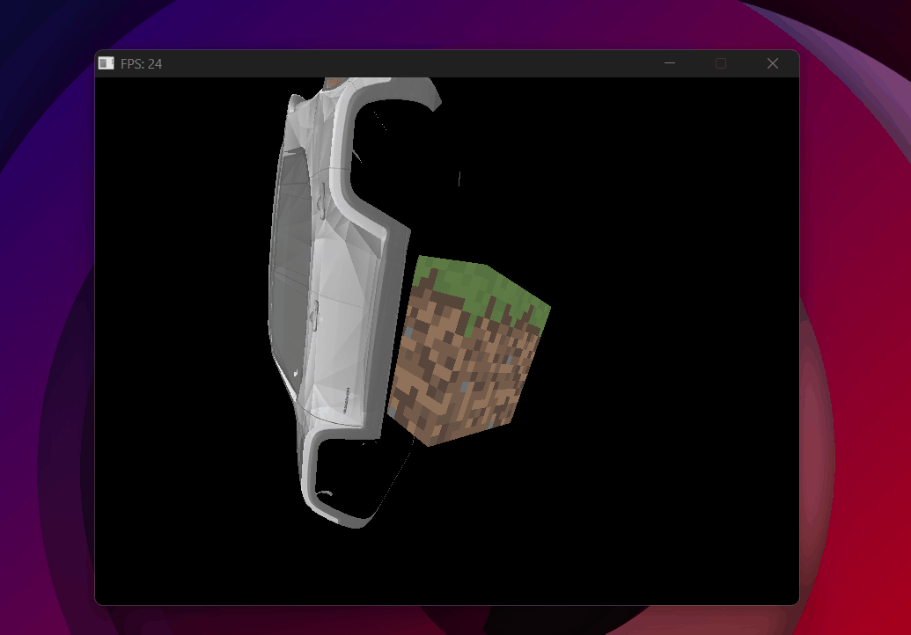

# Phong Lighting & Toon Shading

<p class="subtitle">From flat surfaces to light, shadow, and stylized rendering.</p>

---

## The goal

Up to this point, all objects render with flat texture colors — no sense of light, no visual depth. <span class="accent-gold">Phong shading</span>, developed by Bui Tuong Phong in 1975, was one of the first models to approximate how light interacts with surfaces in a way that's both computationally cheap and visually convincing. It decomposes the light arriving at any surface point into three independent contributions: ambient, diffuse, and specular.

## The Phong model

Each term models a different physical phenomenon:

- <span class="accent-sage">**Ambient** (K_a · I_a)</span> — light that has bounced so many times it arrives equally from all directions. A constant minimum brightness so nothing is ever completely black. I_a is the ambient intensity, a global constant.
- <span class="accent-gold">**Diffuse** (K_d · I_L · (N·L))</span> — light that hits the surface and scatters in all directions equally. I_L is the light's color and intensity. Depends on the angle between the surface normal **N** and the light direction **L** — the more head-on, the brighter.
- <span class="accent-red">**Specular** (K_s · I_L · (R·V)^n)</span> — the shiny highlight. Light that reflects almost perfectly toward the camera. Also scaled by I_L — a brighter light produces a sharper, more intense highlight. Sharpness is controlled by the shininess exponent n.

The full equation with light intensity:

\[ I = K_a \cdot I_a + I_L \cdot [ K_d \cdot (\mathbf{N} \cdot \mathbf{L}) + K_s \cdot (\mathbf{R} \cdot \mathbf{V})^n ] \]

<div class="viz-wrapper">
  <div class="viz-header">
    <span class="viz-label">● Interactive</span>
    <span class="viz-hint">adjust Ka, Kd, Ks and shininess to see each component</span>
  </div>
  <iframe src="../../assets/viz/phong_shading.html" width="100%" height="380" frameborder="0"></iframe>
</div>

## Normals

To compute diffuse and specular, we need the surface normal at every pixel — the vector perpendicular to the surface at that point. Normals come from the `.obj` file per vertex and are interpolated across the triangle using perspective-correct interpolation, just like UVs.

**Why a separate normal matrix.** Normals can't be multiplied by the full model matrix. If the object is scaled non-uniformly, the model matrix would skew the normals and they'd no longer be perpendicular to the surface. The fix: use only the rotation part — no scale, no translation. This keeps normals normalized and correctly oriented.

```cpp
// normalMatrix = rotation only (no scale, no translation)
const Mat4 normalMatrix = rotz_matrix(rotz) * roty_matrix(roty) * rotx_matrix(rotx);

// w=0 because normals are directions — translation must not affect them
Vec4 nor_rotated = normalMatrix * Vec4{nor.x, nor.y, nor.z, 0.0f};
```

We also interpolate the **world-space position** of each pixel — needed to compute the view direction (camera → pixel) and the light direction (light → pixel). Unlike normals, world positions are transformed by the full <span class="accent-gold">model matrix</span> (translation, rotation, and scale) since we need the actual position in the world, not just a direction:

```cpp
// World position — transformed by full modelMatrix
Vec4 ver_world = modelMatrix * Vec4{ver.x, ver.y, ver.z, 1.0f};

// Perspective-correct interpolation of normal and world position
Vec3 normal = norC*e1*(1/w3) + norA*e2*(1/w1) + norB*e3*(1/w2);
normal      = (normal * depth).normalize();

Vec3 real_p = realC*e1*(1/w3) + realA*e2*(1/w1) + realB*e3*(1/w2);
real_p      = real_p * depth;
```

## Computing each component

**Ambient** — constant, independent of light direction:

```cpp
const float Ia  = 0.1f;
Vec3 inten_amb  = ka * Ia;
```

**Diffuse** — dot product of normal and light direction. `std::max(..., 0)` clamps negative values — a surface pointing away from the light contributes zero, not negative light:

```cpp
float diff_factor = std::max(normal * light_dir, 0.0f);
Vec3  inten_dif   = kd * Iluz * diff_factor;
```

**Specular** — requires the reflection vector **R**: the direction light bounces off the surface toward the camera.

Since **R** and **L** are symmetric across the normal, their sum must point exactly along **N**. How long is that sum? The dot product N·L measures how much **L** projects onto **N** — that's how far **L** climbs along the normal axis. **R** climbs the same amount (it's symmetric), so together they add up to 2(N·L) along **N**:

\[ \mathbf{R} + \mathbf{L} = 2(\mathbf{N} \cdot \mathbf{L})\,\mathbf{N} \]

Move **L** to the right side:

\[ \mathbf{R} = 2(\mathbf{N} \cdot \mathbf{L})\,\mathbf{N} - \mathbf{L} \]

```cpp
Vec3  R          = (normal * (2 * (normal * light_dir)) - light_dir).normalize();
float spec_factor = std::max(R * dir_cam, 0.0f);
Vec3  inten_spec  = ks * Iluz * powf(spec_factor, shininess);
```

**Final color:**

```cpp
Vec3 color_final = inten_amb + inten_dif + inten_spec;
```

## Multiple lights

The rasterizer supports two light types: <span class="accent-gold">directional lights</span> (parallel rays, like the sun — direction only, no position) and <span class="accent-gold">spotlights</span> (position + cone angle + radial attenuation). Both live in the same `lights` vector using `std::variant` — a way to store different types in the same list. `std::visit` then runs the right code for whichever type each light actually is:

```cpp
std::vector<std::variant<DirectionalLight, SpotLight>> lights;

for (auto& luz : lights) {
    std::visit([&](auto& l) {
        // l is correctly typed as DirectionalLight or SpotLight
        using T = std::decay_t<decltype(l)>;
        if constexpr (std::is_same_v<T, DirectionalLight>) {
            light_dir = (l.direction * -1).normalize();
        } else {
            // spotlight: attenuation by distance + cone angle factor
            light_dir  = (l.position - real_p).normalize();
            atenuacion = 1 / (1 + 0.05*d + 0.01*d*d);
        }
    }, luz);
}
```

## Toon shading

Toon shading is a Phong variant where continuous values are <span class="accent-red">quantized into discrete bands</span> — instead of a smooth gradient, flat regions of light and shadow. The result is a cel-shaded, cartoon look.

**Quantized diffuse:**

```cpp
float toon;
if      (diff_factor > 0.75f) toon = 1.00f;
else if (diff_factor > 0.50f) toon = 0.75f;
else if (diff_factor > 0.25f) toon = 0.50f;
else                          toon = 0.25f;
```

**Binary specular** — either full white highlight or nothing:

```cpp
if (spec_factor > 0.95f && normal * light_dir > 0.0f)
    color = {1, 1, 1};
```

**Outline** — pixels where the surface is nearly perpendicular to the camera get painted black, creating a hand-drawn edge:

```cpp
if (dir_cam * normal < 0.3f) color = {0, 0, 0};
```

<div class="viz-wrapper">
  <div class="viz-header">
    <span class="viz-label">● Interactive</span>
    <span class="viz-hint">compare Phong and Toon side by side</span>
  </div>
  <iframe src="../../assets/viz/toon_vs_phong.html" width="100%" height="380" frameborder="0"></iframe>
</div>

---

## Bugs

<div class="bug-card">
  <div class="bug-header">
    <span class="bug-tag">BUG</span>
    <span class="bug-title">Lighting doesn't update when the object rotates</span>
  </div>
  <div class="bug-body">
    <div class="bug-row">
      <span class="bug-label">What happened</span>
      <span>One face of the skull was always black — the shading was frozen regardless of rotation.</span>
    </div>
    <div class="bug-row">
      <span class="bug-label">Cause</span>
      <span>Normals weren't being rotated with the object. The raw OBJ normals were used directly, ignoring the model's current orientation.</span>
    </div>
    <div class="bug-row">
      <span class="bug-label">Fix</span>
      <span>Multiply normals by the <code>normalMatrix</code> every frame so they follow the object's rotation.</span>
    </div>
  </div>
</div>

{ .page-img }
<p class="img-caption">Normals not rotating with the object — one face always black regardless of orientation.</p>

<div class="bug-card">
  <div class="bug-header">
    <span class="bug-tag">BUG</span>
    <span class="bug-title">Flat shading — no smooth gradient across the surface</span>
  </div>
  <div class="bug-body">
    <div class="bug-row">
      <span class="bug-label">What happened</span>
      <span>The shading looked faceted — each triangle had a uniform color with a sharp edge at every boundary.</span>
    </div>
    <div class="bug-row">
      <span class="bug-label">Cause</span>
      <span>Normals weren't being interpolated across the triangle. The normal from the first vertex was used for every pixel.</span>
    </div>
    <div class="bug-row">
      <span class="bug-label">Fix</span>
      <span>Interpolate normals per pixel using perspective-correct interpolation — same as UVs.</span>
    </div>
  </div>
</div>

{ .page-img }
<p class="img-caption">The skull with flat shading — each triangle a uniform color, no smooth gradient.</p>

---

## Result

{ .page-img }
<p class="img-caption">Phong working correctly — smooth shading, normals interpolated per pixel.</p>

{ .page-img }
<p class="img-caption">Two skulls side by side — Phong on the left, Toon on the right.</p>

The next step adds shadows to the scene — determining which parts of the surface are blocked from the light entirely.

<div class="page-nav">
  <a href="../08_camera/" class="page-nav-btn prev">← Camera</a>
  <a href="../10_shadows/" class="page-nav-btn next">Shadow Mapping →</a>
</div>