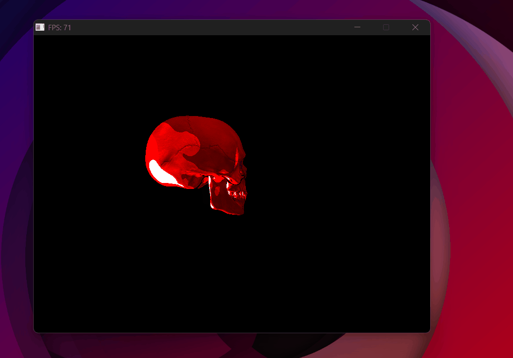
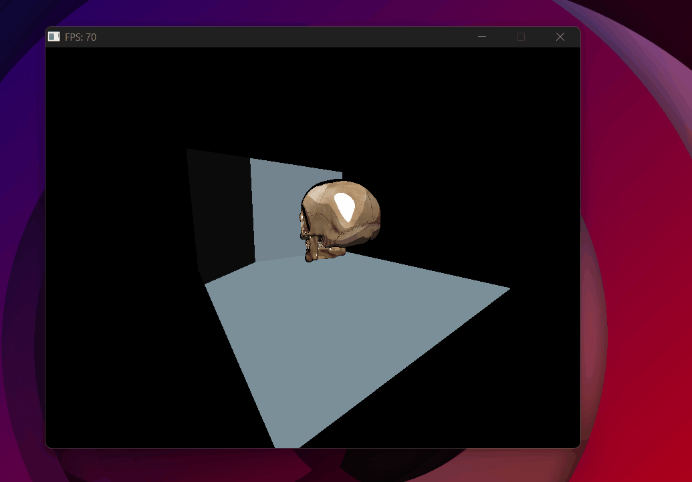
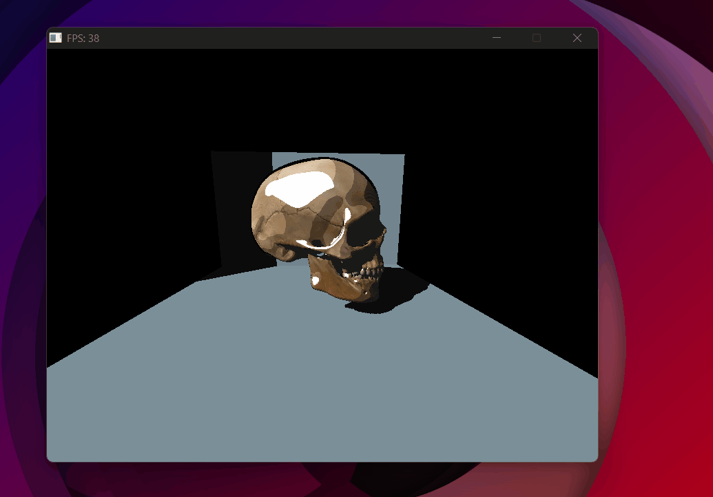
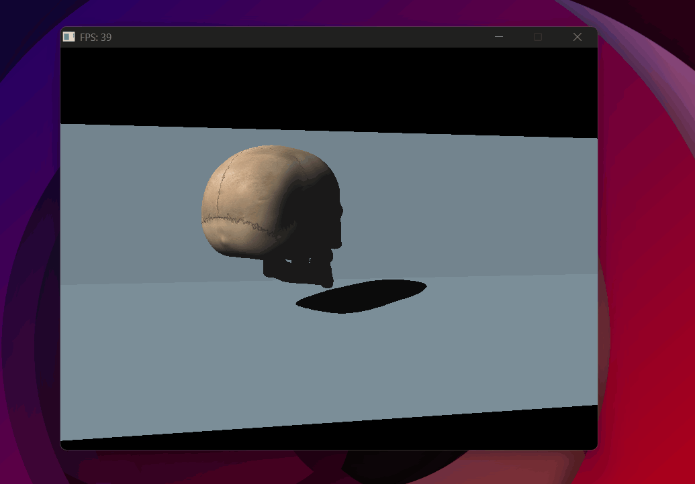
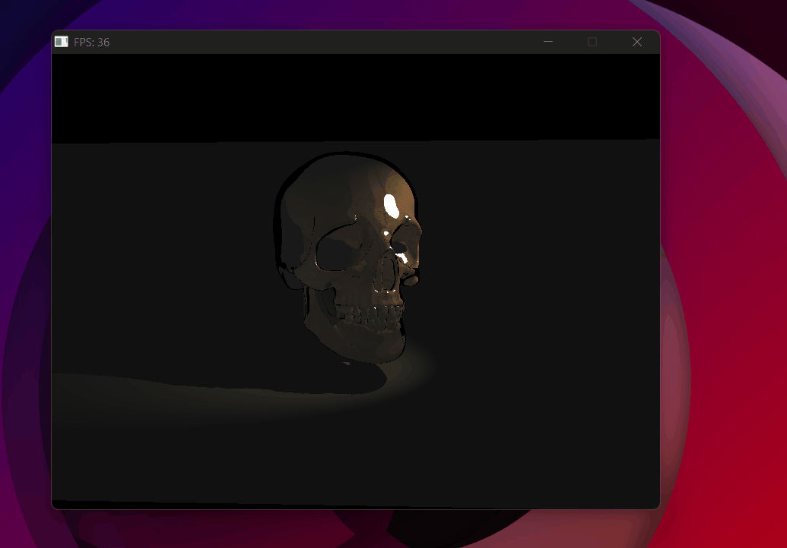
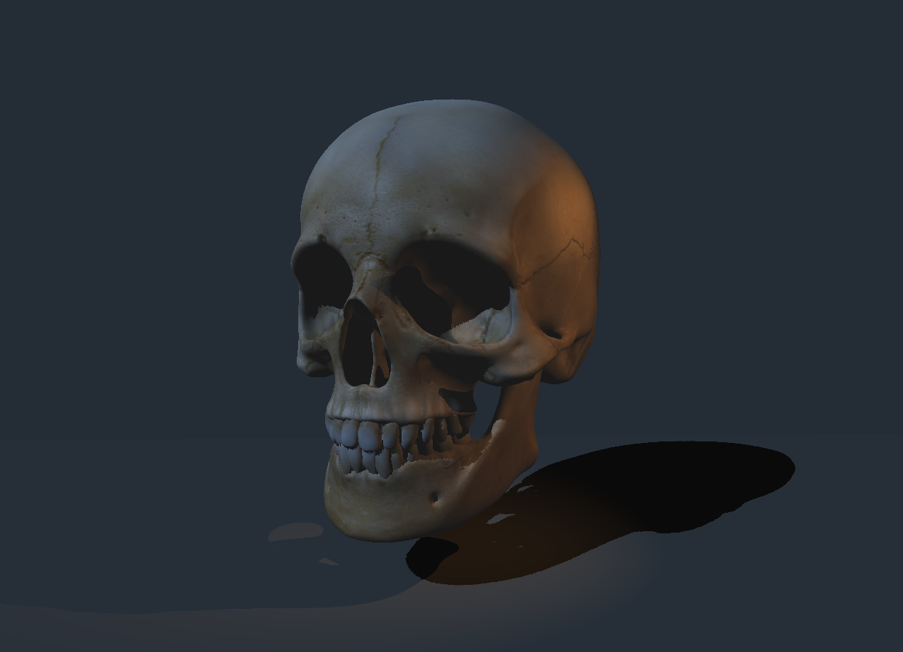
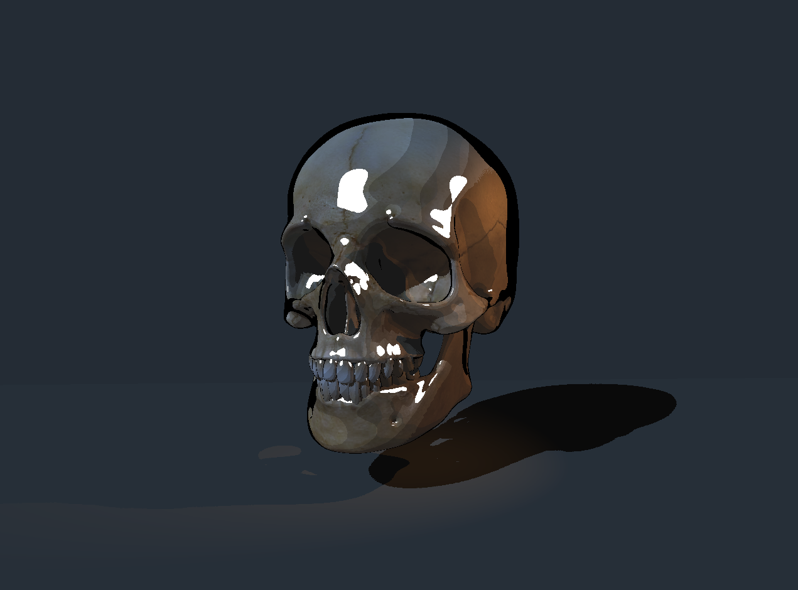

# Shadow Mapping

<p class="subtitle">Teaching the renderer where the light can't reach.</p>

---

## The goal

With Phong working, the scene looks lit but still unrealistic — <span class="accent-red">every surface receives direct light regardless of what's in the way</span>. Even faces on the back of an object that technically face the light source get illuminated, as if the object didn't exist. Shadow mapping fixes this.

The idea: before rendering the scene from the camera, render it from the light's point of view. The result is a <span class="accent-gold">depth buffer seen from the light</span> — the shadow map. Any point in the scene that is farther from the light than what's recorded in that buffer is blocked by something else, and therefore in shadow.

## The shadow pass

A **render pass** is one full traversal of the scene — transforming every vertex, rasterizing every triangle, writing to a buffer. Most renderers use at least two passes per frame.

- <span class="accent-gold">**Pass 1 — Shadow pass:**</span> render the scene from the light's perspective. Store only depth values (no color, no normals, no textures) into a 1024×1024 float buffer. This is the shadow map — essentially a z-buffer from the light's point of view.
- <span class="accent-gold">**Pass 2 — Main pass:**</span> render normally from the camera. For each pixel, project its 3D position into light space and compare its depth to the shadow map. If it's farther away → something is blocking the light → shadow.

<div class="viz-wrapper">
  <div class="viz-header">
    <span class="viz-label">● Interactive</span>
    <span class="viz-hint">see the shadow map and shadow test side by side</span>
  </div>
  <iframe src="../../assets/viz/shadow_mapping.html" width="100%" height="380" frameborder="0"></iframe>
</div>

## Building the shadow map

The light has its own VP matrix — just like the camera, but from the light's perspective.

**For directional lights**, we use an <span class="accent-gold">orthographic projection</span>. A directional light has parallel rays — no convergence point, no perspective. Its view frustum is a simple box (defined by left/right, bottom/top, near/far bounds) rather than a pyramid.

To map that box to NDC [-1,1]³, we need to scale and translate each axis independently. Take X: it currently spans [l, r]. We want it to span [-1, 1]. First center it by subtracting the midpoint (r+l)/2, then scale so the half-width becomes 1:

\[ x_{ndc} = \frac{x - (r+l)/2}{(r-l)/2} = \frac{2x}{r-l} - \frac{r+l}{r-l} \]

Same logic for Y and Z. This gives the full orthographic matrix — just scale and translate, no w tricks, no perspective divide:

\[ M_{ortho} = \begin{pmatrix} 2/(r-l) & 0 & 0 & -(r+l)/(r-l) \\ 0 & 2/(t-b) & 0 & -(t+b)/(t-b) \\ 0 & 0 & 2/(f-n) & -(f+n)/(f-n) \\ 0 & 0 & 0 & 1 \end{pmatrix} \]

```cpp
inline Mat4 ortho_matrix(float l, float r, float b, float t, float n, float f) {
    return {
        2/(r-l), 0,       0,       -(r+l)/(r-l),
        0,       2/(t-b), 0,       -(t+b)/(t-b),
        0,       0,       2/(f-n), -(f+n)/(f-n),
        0,       0,       0,        1
    };
}
```

**For spotlights**, we use a standard perspective projection since the light emanates from a point.

```cpp
// Directional light — orthographic projection
l.light_vp = ortho_matrix(-35, -5, -15, 15, 0.1f, 80.f) *
             lookAt_matrix(light_pos, {0,0,0});

// Spotlight — perspective projection
s.light_vp = projection_matrix(s.cone_angle, 1.0f, 0.1f, 50.f) *
             lookAt_matrix(s.position, spot_target);
```

The shadow pass rasterizes every triangle but skips all the expensive lighting math — only depth matters:

```cpp
// Project vertex to light space
Vec4 clip = luz.light_vp * Vec4{ver.x, ver.y, ver.z, 1.0f};
Vec3 ndc  = {clip.x/clip.w, clip.y/clip.w, clip.z/clip.w};

// Store depth in shadow map — same z-buffer logic as the main pass
if (ndc.z < shadow_map[sy * 1024 + sx]) {
    shadow_map[sy * 1024 + sx] = ndc.z;
}
```

One important detail: the shadow pass interpolates depth <span class="accent-gold">linearly</span> — and this is <span class="accent-sage">exactly correct</span>, even for the spotlight's perspective projection. After the perspective divide, z_ndc is an affine function of the NDC screen coordinates — which means it's already linear in screen space. No perspective-correct interpolation needed. This is different from UV coordinates or normals, which live in object space and need the 1/w correction. Depth is already "in" the right space after the divide.

## The shadow test

In the main pass, for each pixel we project its world-space position into light space and look it up in the shadow map:

```cpp
// Project pixel world position to light space
Vec4 pos_luz = l.light_vp * Vec4{real_p.x, real_p.y, real_p.z, 1.0f};
Vec3 ndc_luz = {pos_luz.x/pos_luz.w, pos_luz.y/pos_luz.w, pos_luz.z/pos_luz.w};

// Convert NDC [-1,1] to shadow map coordinates [0,1023]
int sx = (ndc_luz.x + 1.0f) * 0.5f * 1023;
int sy = (1.0f - ndc_luz.y) * 0.5f * 1023;

float depth_luz = shadow_map[sy * 1024 + sx];
bool  sombreado = (ndc_luz.z > depth_luz + bias);
```

## Shadow acne and bias

Without bias, <span class="accent-red">shadow acne</span> appears — a pattern of dark speckles across all lit surfaces. The cause is floating point precision. When we project a point into light space and compare its depth to the shadow map, we're comparing the point to an approximation of itself. Tiny rounding errors cause a point to be slightly farther than its own recorded depth — and it incorrectly shadows itself.

The fix is a small **bias** — not "significantly farther", just a tiny nudge that absorbs the precision error. The bias adapts based on surface angle: surfaces nearly perpendicular to the light have more depth error, so they need a slightly larger bias:

```cpp
float n_dot_l = normal * light_dir;
float bias    = std::max(0.0005f, 0.01f * (1.0f - n_dot_l));
```

Try adjusting the bias in the interactive demo above — too small and acne appears, too large and shadows detach from their casters.

## The dirty flag

Recomputing the shadow map every frame is expensive — and unnecessary if <span class="accent-sage">neither the lights nor any object in the scene has moved, rotated, or scaled</span>. The dirty flag skips the shadow pass when nothing has changed:

```cpp
bool dirty = true;  // recompute this frame
// ...after shadow pass:
luz.dirty = false;  // skip next frame unless something changes
```

In this project the lights are static, so the shadow map is computed once at startup and never again — a significant performance win.

## Spotlight

A spotlight is a point light with a cone — only pixels inside the cone receive light, with a smooth falloff at the edges.

**Cone test.** The cone is defined by a direction and an angle. For each lit pixel, we compute the angle between the light-to-pixel direction and the cone's axis using a dot product. If the pixel is outside the cone angle, it receives no light:

```cpp
float cos_outer = cosf(radianes(l.cone_angle) / 2);
if (light_dir * cone_dir < cos_outer) no_aporta = true;
```

**Radial attenuation.** At a hard cone boundary the light would cut off sharply — one pixel fully lit, the next completely dark. To soften the edge, we define two angles: an inner cone (full intensity) and an outer cone (zero intensity), and linearly interpolate between them:

\[ 	{factor} = \frac{\cos\theta_{actual} - \cos\theta_{outer}}{\cos\theta_{inner} - \cos\theta_{outer}} \]

Where θ_actual is the angle between the light direction and the pixel direction. When the pixel is inside the inner cone the factor is ≥ 1, outside the outer cone it's ≤ 0 — clamped to [0, 1]:

```cpp
float cos_inner  = cosf(radianes(30) / 2);           // inner cone — full intensity
float cos_outer  = cosf(radianes(l.cone_angle) / 2); // outer cone — zero intensity
float cos_actual = light_dir * cone_dir;

float factor = (cos_actual - cos_outer) / (cos_inner - cos_outer);
factor = std::clamp(factor, 0.0f, 1.0f);
```

**Distance attenuation.** Light also weakens with distance — a standard quadratic falloff:

\[ 	{attenuation} = \frac{1}{1 + k_1 d + k_2 d^2} \]

```cpp
float d = (l.position - real_p).length();
float atenuacion = 1 / (1 + 0.05f*d + 0.01f*d*d);
```

Both factors multiply the final light intensity: `Iluz = l.color * atenuacion * factor`.

---

## Bugs

<div class="bug-card">
  <div class="bug-header">
    <span class="bug-tag">BUG</span>
    <span class="bug-title">Skull appears solid red — background disappears</span>
  </div>
  <div class="bug-body">
    <div class="bug-row">
      <span class="bug-label">What happened</span>
      <span>The skull rendered as a flat red shape and the room disappeared entirely.</span>
    </div>
    <div class="bug-row">
      <span class="bug-label">Cause</span>
      <span>The light contribution was being computed with a dot product between color vectors (<code>color * light_color</code> = single float) instead of component-wise multiplication (<code>{cx*lx, cy*ly, cz*lz}</code>).</span>
    </div>
    <div class="bug-row">
      <span class="bug-label">Fix</span>
      <span>Replace the dot product operator with a component-wise multiply for color calculations.</span>
    </div>
  </div>
</div>

{ .page-img }
<p class="img-caption">Wrong vector operator — skull collapses to solid red, background vanishes.</p>

<div class="bug-card">
  <div class="bug-header">
    <span class="bug-tag">BUG</span>
    <span class="bug-title">No shadows — everything fully lit</span>
  </div>
  <div class="bug-body">
    <div class="bug-row">
      <span class="bug-label">What happened</span>
      <span>The shadow map was filling correctly but no shadows appeared in the scene.</span>
    </div>
    <div class="bug-row">
      <span class="bug-label">Cause</span>
      <span>The shadow map was initialized to <code>0</code> instead of <code>HUGE_VALF</code>. A depth of 0 means "something is at distance 0 from the light" — so every point in the scene appeared to be behind something, and the entire scene was marked as lit (the shadow test requires being farther than the stored depth, but nothing can be farther than 0).</span>
    </div>
    <div class="bug-row">
      <span class="bug-label">Fix</span>
      <span>Initialize the shadow map to <code>HUGE_VALF</code> — positive infinity — so that the first depth value written always wins, exactly like the main z-buffer.</span>
    </div>
  </div>
</div>

{ .page-img }
<p class="img-caption">Shadow test inverted — shadow map fills correctly but nothing casts a shadow.</p>

<div class="bug-card">
  <div class="bug-header">
    <span class="bug-tag">BUG</span>
    <span class="bug-title">Shadow acne across the scene</span>
  </div>
  <div class="bug-body">
    <div class="bug-row">
      <span class="bug-label">What happened</span>
      <span>Dark speckles covered all lit surfaces, making the scene look noisy.</span>
    </div>
    <div class="bug-row">
      <span class="bug-label">Cause</span>
      <span>No bias — surfaces were self-shadowing due to floating point precision errors.</span>
    </div>
    <div class="bug-row">
      <span class="bug-label">Fix</span>
      <span>Add an adaptive bias based on the angle between the surface normal and the light direction.</span>
    </div>
  </div>
</div>

{ .page-img }
<p class="img-caption">Shadow acne — every lit surface self-shadows due to floating point errors.</p>

{ .page-img }
<p class="img-caption">Shadow acne removed with toon shading — backface culling in the shadow pass helps significantly.</p>

{ .page-img }
<p class="img-caption">Improved bias — Phong shading with clean shadows, no acne, no detachment. (Decided not to use backface culling)</p>

---

## Result — The final scene

{ .page-img }
<p class="img-caption">Spotlight working — two light sources illuminating the scene.</p>

{ .page-img }
<p class="img-caption">Spotlight with radial lerp attenuation — soft edge at the cone boundary.</p>

{ .page-img }
<p class="img-caption">Final Phong scene — two skulls, two lights, shadow mapping.</p>

<div style="position:relative; z-index:10; margin: 1rem 0;">
<video controls style="width:100%; border-radius:8px; border:0.5px solid #2a2520; display:block;">
  <source src="../../assets/img/result_final_phong_scene.mkv" type="video/mp4">
</video>
</div>
<p class="img-caption">Final Phong scene — free camera, ~30 FPS on CPU.</p>

{ .page-img }
<p class="img-caption">Final Toon scene — same setup, cel-shaded.</p>

<div style="position:relative; z-index:10; margin: 1rem 0;">
<video controls style="width:100%; border-radius:8px; border:0.5px solid #2a2520; display:block;">
  <source src="../../assets/img/result_final_toon_scene.mkv" type="video/mp4">
</video>
</div>
<p class="img-caption">Final Toon scene in motion.</p>

<div class="page-nav">
  <a href="../09_lighting/" class="page-nav-btn prev">← Phong & Toon Shading</a>
  <a href="../../extras/bugs/" class="page-nav-btn next">Bugs — Hall of Fame →</a>
</div>